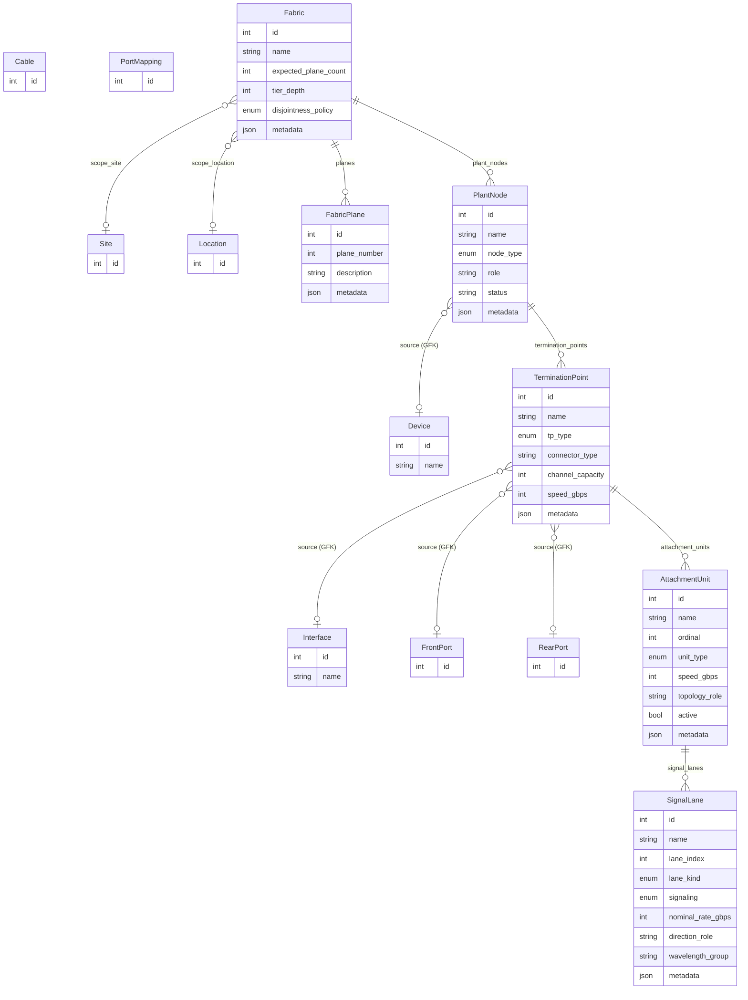
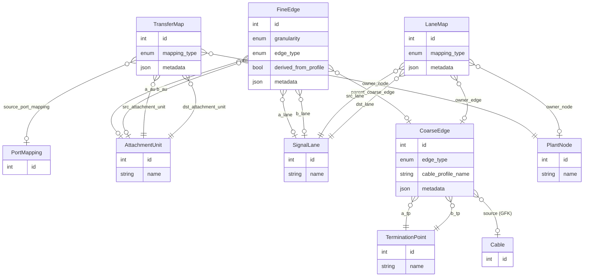
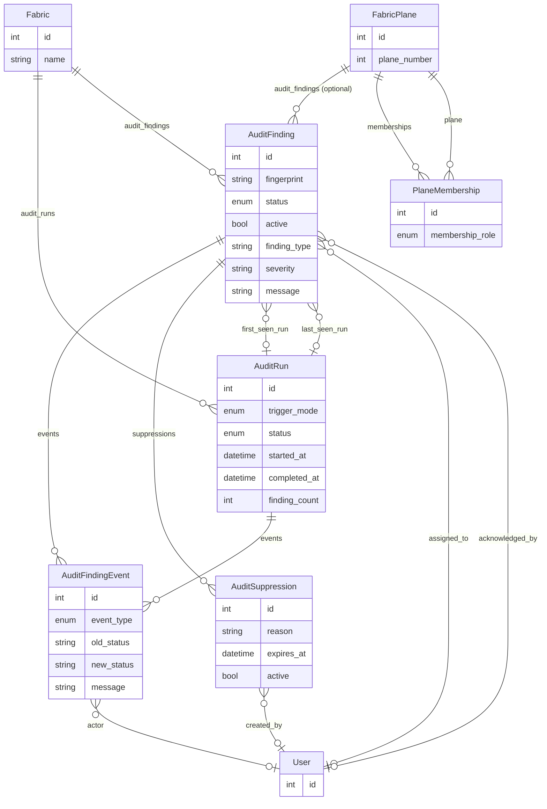
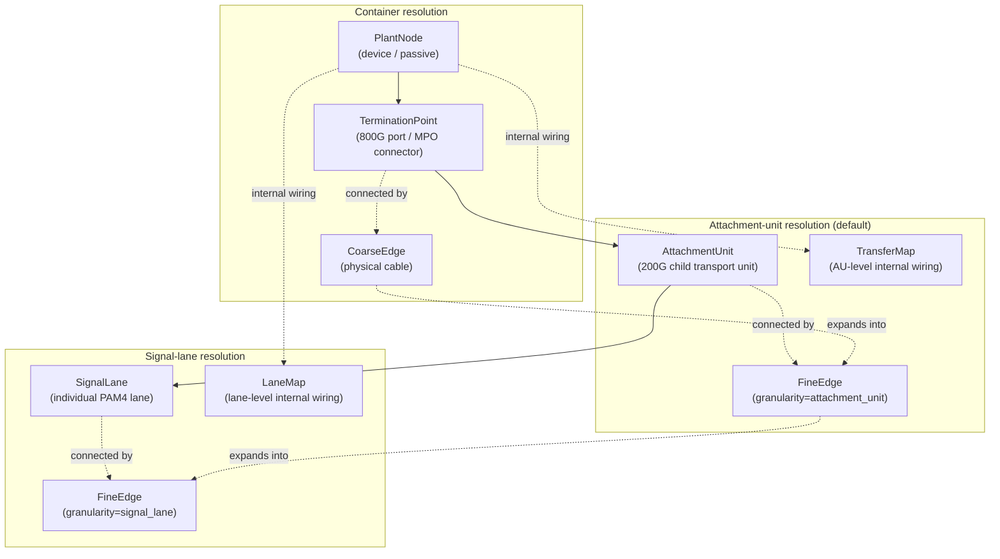
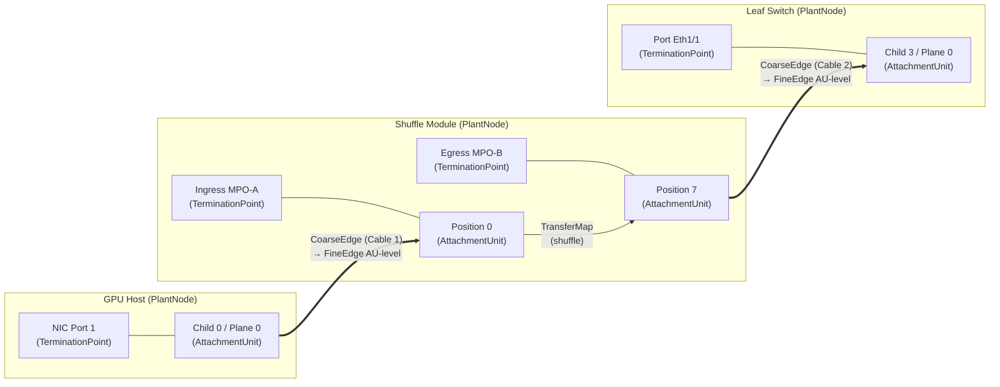

# netbox\_plant\_graph Data Model

This document describes the data model used by the `netbox_plant_graph` plugin,
maps each model element to the real-world network architecture concept it
represents, and illustrates the relationships between plugin models and the
NetBox core models they reference.

---

## Ownership legend

Throughout this document:

- **Plugin model** — defined and owned by `netbox_plant_graph`
- **NetBox core model** — defined by NetBox itself; referenced by the plugin via foreign key or generic relation

---

## 1. Conceptual architecture overview

A multi-plane GPU fabric has a layered physical structure. The plugin captures
this structure as a **derived, normalized graph** that sits alongside NetBox
core inventory data. The graph is not a replacement for NetBox cabling—it is a
topology overlay that makes plane-aware, lane-aware queries possible.

The real-world architecture, from coarsest to finest grain:

| Layer | Real-world concept | Plugin model(s) |
|---|---|---|
| **Fabric** | An entire multi-plane RoCEv2 fabric spanning a site, hall, or pod | `Fabric` |
| **Plane** | One independent forwarding plane within the fabric (typically 4–8 per fabric) | `FabricPlane` |
| **Network element** | A device, patch panel, shuffle module, cassette, or cable assembly that participates in the physical plant | `PlantNode` |
| **Physical port / connector** | An 800G interface, front port, rear port, panel face, or MPO connector | `TerminationPoint` |
| **Transport unit** | A 200G child interface or passive sub-port group inside a physical port—the unit of plane membership | `AttachmentUnit` |
| **Lane primitive** | An individual PAM4 or NRZ electrical/optical TX or RX lane inside a transport unit | `SignalLane` |
| **Physical link** | A cable connecting two physical ports | `CoarseEdge` |
| **Derived sub-link** | A derived connection between attachment units or signal lanes after profile/mapping expansion | `FineEdge` |
| **Internal device mapping** | The internal wiring of a passive device (shuffle, breakout, polarity swap) at the attachment-unit level | `TransferMap` |
| **Internal lane mapping** | The internal wiring at the signal-lane level (lane shuffle, polarity swap, optic mux/demux) | `LaneMap` |
| **Plane assignment** | The association of any graph element (node, edge, attachment unit, …) with a specific plane | `PlaneMembership` |
| **Audit lifecycle** | Automated validation of fabric integrity: run records, findings, events, suppressions | `AuditRun`, `AuditFinding`, `AuditFindingEvent`, `AuditSuppression` |

---

## 2. Model relationship diagrams

### 2.1 Core plant hierarchy

This diagram shows the main containment hierarchy from Fabric down to SignalLane, and the edge models that connect them. Dashed borders indicate NetBox core models.

### 2.2 Edge models (topology connections)

### 2.3 Plane membership and audit models

---

## 3. Model-by-model reference

### 3.1 Fabric — *the multi-plane fabric*

| Attribute | Purpose |
|---|---|
| `name` | Unique human-readable identifier for the fabric (e.g. "DGX-Hall-A-Fabric") |
| `expected_plane_count` | The designed number of independent forwarding planes (commonly 4 or 8) |
| `tier_depth` | Number of switching tiers in the fabric (e.g. 3 for leaf/spine/superspine) |
| `disjointness_policy` | How strictly the fabric enforces plane isolation: `full`, `tier_aware`, or `best_effort` |
| `scope_site` | **NetBox Site** that physically contains this fabric |
| `scope_location` | **NetBox Location** (hall, pod, row) that scopes this fabric |

**Network architecture concept:** A Fabric represents a complete multi-plane RoCEv2 switching fabric.
In a GPU supercomputer installation, each compute hall or pod typically contains
one fabric with multiple independent forwarding planes. The fabric is the
top-level scope for graph rebuilds, plane audits, and blast-radius queries.

---

### 3.2 FabricPlane — *one independent forwarding plane*

| Attribute | Purpose |
|---|---|
| `fabric` | Parent Fabric |
| `plane_number` | Ordinal index of this plane within its fabric (0-based or 1-based by convention) |

**Network architecture concept:** In a multi-plane RoCEv2 fabric, each GPU NIC
port is subdivided into multiple child transport units, and each child is
assigned to a different plane. Traffic within a plane follows a physically
independent path through the switching tiers. Plane isolation is a key design
invariant—the plugin's audit system validates that passive infrastructure does
not inadvertently bridge planes.

---

### 3.3 PlantNode — *any topology-bearing network element*

| Attribute | Purpose |
|---|---|
| `fabric` | Parent Fabric this node belongs to |
| `name` | Unique-within-fabric name |
| `node_type` | What kind of physical element: `device`, `patch_panel`, `shuffle_module`, `cassette`, `cable_assembly`, `trunk_bundle`, `passive_device` |
| `role` | Free-form role string (e.g. "leaf", "spine", "gpu-host") |
| `status` | Free-form status string |
| `source` | **Generic FK → NetBox Device** (or other core object) that this node was derived from |
| `location` | **Generic FK → NetBox Site/Location/Rack** for physical placement |

**Network architecture concept:** Every physical device or passive element that
participates in the fabric's topology is represented as a PlantNode. This
includes not only switches and hosts (which are NetBox Devices), but also
patch panels, shuffle modules, cassettes, and cable assemblies—passive elements
that carry meaningful internal mapping semantics and affect how lanes are routed
through the physical plant.

The `source` generic foreign key links back to the NetBox core Device (or other
inventory object) from which this node was derived during graph rebuild.

---

### 3.4 TerminationPoint — *a physical port or connector*

| Attribute | Purpose |
|---|---|
| `plant_node` | Parent PlantNode |
| `name` | Port/connector name (mirrors the NetBox interface/port name) |
| `tp_type` | What kind of termination: `interface`, `front_port`, `rear_port`, `connector`, `panel_face` |
| `connector_type` | Physical connector form factor (e.g. QSFP-DD, MPO-16) |
| `channel_capacity` | Number of attachment units this port can host (e.g. 4 for an 800G port with 4×200G children) |
| `speed_gbps` | Aggregate port speed |
| `source` | **Generic FK → NetBox Interface, FrontPort, or RearPort** |

**Network architecture concept:** A TerminationPoint is the container-level
representation of a physical port or connector. In a typical 800G GPU fabric,
this is one QSFP-DD or OSFP port—which is *not* the atomic transport endpoint.
The port is a container for multiple lower-speed attachment units. For passive
devices, the TerminationPoint represents a panel face, MPO port, or connector.

---

### 3.5 AttachmentUnit — *a child transport unit (the unit of plane membership)*

| Attribute | Purpose |
|---|---|
| `termination_point` | Parent TerminationPoint (the physical port this unit lives inside) |
| `name` | Child interface name or passive group identifier |
| `ordinal` | Position index within the parent port |
| `unit_type` | `child_interface`, `passive_group`, or `logical_slice` |
| `speed_gbps` | Per-unit speed (e.g. 200 for a 200G child of an 800G port) |
| `topology_role` | Free-form role in the topology |
| `active` | Whether this unit is operationally active |
| `source` | **Generic FK → NetBox Interface** (the child interface this was derived from) |

**Network architecture concept:** The AttachmentUnit is the most important
abstraction in the plugin. It represents a **200G child transport unit**—the
true atomic endpoint for fabric pathing. In a 4-plane fabric, an 800G GPU NIC
port contains 4 × 200G attachment units, each assigned to a different plane.
Operational queries (path resolution, blast-radius analysis, plane-disjointness
audit) default to attachment-unit granularity because this is the level at which
plane identity is meaningful.

For passive devices, attachment units represent grouped sets of positions that
participate together in one path segment.

---

### 3.6 SignalLane — *an individual PAM4/NRZ lane primitive*

| Attribute | Purpose |
|---|---|
| `attachment_unit` | Parent AttachmentUnit |
| `name` | Lane identifier |
| `lane_index` | Position index within the attachment unit |
| `lane_kind` | `electrical_tx`, `electrical_rx`, `optical_tx`, `optical_rx` |
| `signaling` | Encoding scheme: `pam4`, `nrz`, `unknown` |
| `nominal_rate_gbps` | Per-lane data rate (e.g. 50 Gbps for PAM4) |
| `direction_role` | TX or RX directionality |
| `wavelength_group` | Optical wavelength grouping, if applicable |

**Network architecture concept:** A SignalLane is the finest physical primitive
in the model. A 200G PAM4 transport unit contains 4 × ~53 Gbps lanes (2 TX +
2 RX in a typical SerDes configuration). Most operational workflows do not need
lane-level detail, but forensic debugging of miswired shuffle cables or
incorrect polarity requires visibility into individual lanes. The
`materialize_signal_lanes` configuration flag controls whether the graph rebuild
creates these objects.

---

### 3.7 CoarseEdge — *a physical cable between two ports*

| Attribute | Purpose |
|---|---|
| `edge_type` | `cable` or `logical` |
| `a_tp` / `b_tp` | The two TerminationPoints this edge connects |
| `source` | **Generic FK → NetBox Cable** |
| `cable_profile_name` | Name of the cable profile used for lane/breakout expansion |

**Network architecture concept:** A CoarseEdge represents one physical cable at
container resolution. It corresponds 1:1 with a NetBox Cable record. The edge
connects two TerminationPoints and serves as the parent for derived FineEdges.
When the cable has a profile (e.g. a breakout or shuffle cable), the profile
drives how the CoarseEdge is expanded into finer-grained FineEdges during graph
rebuild.

---

### 3.8 FineEdge — *a derived sub-link at attachment-unit or signal-lane resolution*

| Attribute | Purpose |
|---|---|
| `granularity` | `attachment_unit` or `signal_lane` |
| `edge_type` | `derived_cable_segment`, `passthrough_map`, `lane_segment` |
| `a_au` / `b_au` | Attachment-unit endpoints (when granularity = attachment_unit) |
| `a_lane` / `b_lane` | SignalLane endpoints (when granularity = signal_lane) |
| `parent_coarse_edge` | The CoarseEdge this fine edge was derived from |
| `derived_from_profile` | Whether this edge was generated from a cable profile |

**Network architecture concept:** FineEdges are the result of expanding a
physical cable into its constituent transport paths. A single 800G cable
connecting two ports becomes (for example) 4 attachment-unit-level FineEdges,
one per 200G child pair. If the cable is a shuffle cable, the mapping between
source and destination children is non-trivial and profile-driven. At
signal-lane resolution, each attachment-unit FineEdge further expands into
individual lane-to-lane connections.

---

### 3.9 TransferMap — *internal attachment-unit-level wiring inside a passive device*

| Attribute | Purpose |
|---|---|
| `owner_node` | The PlantNode (passive device) that owns this internal mapping |
| `src_attachment_unit` / `dst_attachment_unit` | The ingress and egress attachment units within the device |
| `mapping_type` | `identity`, `shuffle`, `breakout`, `polarity_swap`, `grouping` |
| `source_port_mapping` | **NetBox PortMapping** that this transfer map was derived from |

**Network architecture concept:** Passive devices like shuffle modules,
cassettes, and patch panels have internal wiring that routes signals from
ingress ports to egress ports. A TransferMap captures this mapping at
attachment-unit granularity. For an identity patch panel, ingress position N
maps to egress position N. For a shuffle module, the mapping is intentionally
non-trivial—it re-distributes child transport units across planes to achieve
plane diversity.

---

### 3.10 LaneMap — *internal signal-lane-level wiring*

| Attribute | Purpose |
|---|---|
| `owner_node` | PlantNode that owns this mapping (for device-internal lane routing) |
| `owner_edge` | CoarseEdge that owns this mapping (for cable-internal lane routing) |
| `src_lane` / `dst_lane` | The source and destination SignalLanes |
| `mapping_type` | `identity`, `lane_shuffle`, `polarity_swap`, `serdes_grouping`, `optic_mux`, `optic_demux` |

**Network architecture concept:** LaneMaps extend TransferMaps to the
signal-lane level. They capture how individual electrical or optical lanes are
routed through a device or cable. Polarity swaps (where TX/RX pairs are
inverted), optical mux/demux operations (where multiple lanes are wavelength-
multiplexed onto a single fiber), and SerDes groupings are all modeled here.

---

### 3.11 PlaneMembership — *assignment of a graph element to a plane*

| Attribute | Purpose |
|---|---|
| `plane` | The FabricPlane |
| `member` | **Generic FK** → any plugin model (PlantNode, AttachmentUnit, CoarseEdge, FineEdge, etc.) |
| `membership_role` | `native` (exclusively this plane), `shared` (belongs to multiple planes), `transit` (passes through), `cross_plane_exception` (intentional violation) |

**Network architecture concept:** Plane membership is the mechanism by which
the plugin tracks which forwarding plane each element belongs to. In a properly
constructed fabric, each 200G attachment unit, its associated FineEdges, and the
passive path segments it traverses should all belong to exactly one plane.
Shared or transit memberships occur at tier boundaries (e.g., a spine device may
carry traffic for all planes). Cross-plane exceptions are flagged for audit.

---

### 3.12 Audit models — *fabric integrity validation lifecycle*

#### AuditRun

| Attribute | Purpose |
|---|---|
| `fabric` | The Fabric being audited |
| `scope` | **Generic FK** — optional narrower scope (a single plane, node, etc.) |
| `trigger_mode` | `manual`, `job`, or `post_rebuild` |
| `status` | `pending`, `running`, `completed`, `failed` |
| `finding_count` / `new_count` / `reopened_count` / `resolved_count` | Summary counters |

**Network architecture concept:** An AuditRun is one execution of the fabric
integrity checker. It detects violations such as plane-disjointness breaches,
missing port mappings on cabled passive ports, incomplete child interface sets,
mismatched cable profiles, and orphaned attachment units.

#### AuditFinding

| Attribute | Purpose |
|---|---|
| `fabric` / `plane` | Scope of the finding |
| `fingerprint` | Stable hash for deduplication across runs |
| `finding_type` | Machine-readable category (e.g. `missing_port_mapping`, `plane_disjointness_violation`) |
| `severity` | Severity level |
| `object` | **Generic FK** → the offending NetBox or plugin object |
| `status` | `open`, `acknowledged`, `in_progress`, `suppressed`, `resolved` |
| `message` | Human-readable description |

#### AuditFindingEvent

Tracks status transitions (opened, reopened, status changed, resolved, etc.)
with actor attribution and timestamps.

#### AuditSuppression

Allows operators to temporarily suppress a finding with a reason and optional
expiry, so it does not re-alert during subsequent audit runs.

---

## 4. Resolution hierarchy

The plugin's graph supports three query resolutions. Each resolution maps to a
tier of the model hierarchy:

---

## 5. NetBox core model touchpoints

The plugin references these NetBox core models. It never modifies them—it reads
them during graph rebuild and stores back-references via generic foreign keys
and nullable foreign keys.

| NetBox core model | How the plugin uses it |
|---|---|
| **`dcim.Site`** | Optional geographic scope for a Fabric |
| **`dcim.Location`** | Optional location scope (hall, pod, row) for a Fabric |
| **`dcim.Device`** | Source object for PlantNode (via GFK). Switches, hosts, and passive devices are all Devices in NetBox |
| **`dcim.Interface`** | Source object for TerminationPoint and AttachmentUnit (via GFK). Parent interfaces map to TPs; child interfaces map to AUs |
| **`dcim.FrontPort`** | Source object for TerminationPoint (via GFK) on passive devices |
| **`dcim.RearPort`** | Source object for TerminationPoint (via GFK) on passive devices |
| **`dcim.Cable`** | Source object for CoarseEdge (via GFK) |
| **`dcim.PortMapping`** | Source for TransferMap derivation; represents the internal cross-connect of a passive device in NetBox core |
| **`auth.User`** | Actor attribution on AuditFinding, AuditFindingEvent, and AuditSuppression |

---

## 6. End-to-end path example

To illustrate how the models compose, consider a single 200G path from a GPU
NIC to its serving leaf switch through a shuffle module:

In this path:
- Two **CoarseEdges** represent the physical cables (GPU→shuffle, shuffle→leaf)
- Each CoarseEdge is expanded into **FineEdges** at attachment-unit resolution
- A **TransferMap** with `mapping_type=shuffle` captures the shuffle module's internal re-mapping from ingress position 0 to egress position 7
- A **PlaneMembership** record assigns each AttachmentUnit and FineEdge to Plane 0
