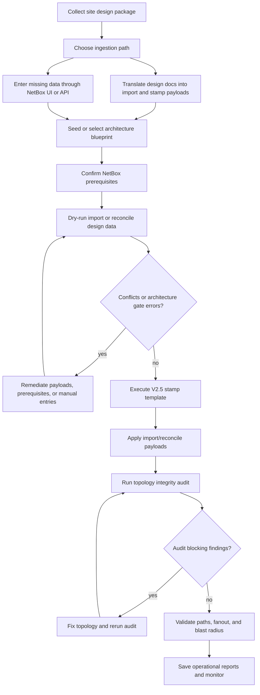
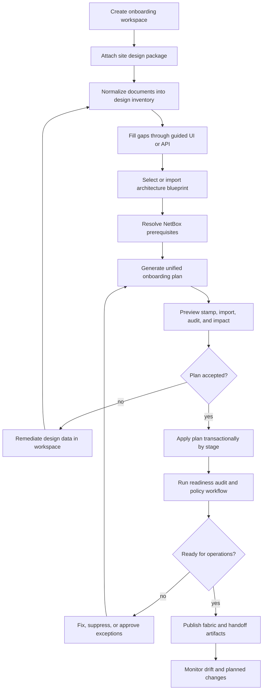

# V2 Fabric Onboarding Workflows

Last updated: 2026-05-22

This document describes the current and desired workflows for onboarding a
net-new multi-planar RoCE fabric into NetBox and the
`netbox_multiplanar_fabrics` plugin.

The process explicitly supports two source paths:

1. **Site design documents**: blueprints, spreadsheets, diagram files, cable
   schedules, rack plans, BOM exports, and vendor/reference architecture files.
2. **Direct NetBox/plugin entry**: UI or API entry when some or all design data
   is not available as site design documents.

The current workflow now has a first-class `OnboardingWorkspace` path for the
core source -> normalize -> prerequisites -> plan -> approve/apply -> readiness
loop. Some rich document parsing and planned-graph simulation work remains
future-state, but the desired workflow's durable workspace spine is now present.

## Current-State Workflow

The flow below can still be executed manually across the existing pages and
commands, but operators should prefer `Build & Run -> Onboarding Workspaces`
for net-new fabrics. The workspace keeps source artifacts, staged design rows,
prerequisites, plan hashes, execution stages, readiness, and handoff artifacts
in one persistent record.

### C0: Collect site design package

Current onboarding begins outside NetBox. Operators gather the available site
design package: architecture blueprints, site-specific spreadsheets, cabling
diagrams, rack elevations, device inventories, port maps, cable schedules, and
vendor/reference files.

The plugin can ingest some of this data indirectly through import/reconcile
payloads or blueprint bundles, but it does not yet manage design documents as
first-class source records. The current operator burden is to identify which
parts of the design package are authoritative and which parts must be entered
manually.

### C1: Choose ingestion path

The operator decides whether each data class will come from a document-derived
payload or direct NetBox/plugin entry.

Typical document-derived inputs:

- `.mpf-blueprint.json` architecture bundles,
- JSON import/reconcile payloads generated from spreadsheets or scripts,
- stamp template parameters derived from rack/pod/site planning worksheets,
- cable assembly and strand assignment payloads derived from cable schedules.

Typical direct-entry inputs:

- NetBox `Site`, `Rack`, `DeviceType`, `DeviceRole`, and `Device` objects,
- plugin `FabricArchitecture`, `Fabric`, `CableAssembly`, or topology rows
  through generated CRUD views/API endpoints,
- ad hoc missing cable IDs, serials, descriptions, or endpoint labels.

### C2A: Translate design docs into import and stamp payloads

Design documents must be transformed into plugin-readable JSON before the plugin
can apply them. Today this translation is normally done by external scripts or
operator-prepared payloads.

Current supported payload paths include:

- `fabric_architecture_blueprint` import items for architecture definitions and
  optional bundled `StampTemplate` rows,
- `.mpf-blueprint.json` bundles normalized by Import Preview/import reconcile,
- `cable_assembly` and `fiber_strand_cable` import items,
- endpoint, transport channel, transport channel position map, and strand
  termination import items,
- `StampTemplate` parameters for V2.5 preview/apply.

### C2B: Enter missing data through NetBox UI or API

When design data is absent, incomplete, or intentionally built live, operators
can use NetBox and plugin-native surfaces directly.

Current direct-entry mechanisms:

- NetBox UI/API for core inventory prerequisites such as sites, device roles,
  device types, devices, racks, and interfaces.
- Plugin generated CRUD/API views for fabrics, architectures, cable assemblies,
  endpoints, strands, lanes, transfer maps, stamp templates, and operation
  records.
- Import Preview with hand-authored JSON pasted into the browser.
- `POST /api/plugins/plant-graph/...` registry endpoints for automation that
  already has normalized model data.

This works, but the data-entry path is not yet a guided design-workspace
experience. The operator must know the model order and topology semantics.

### C3: Seed or select architecture blueprint

The fabric must target a known architecture contract before stamping or
architecture-gated import can be trusted.

Current mechanisms:

- `python manage.py mpf_seed_v2 --architecture-only` seeds the persisted GB300
  four-plane shuffle fixture and its default stamp template.
- The default blueprint registry provides active built-ins for GB300 four-plane
  shuffle, GB300 eight-plane shuffle, and H100 direct attach.
- Architecture Workspaces are the preferred current UI/API path for externally
  supplied or operator-authored architecture bundles: attach source, normalize,
  validate, generate/approve a publish plan, and publish into
  `FabricArchitecture` before fabric onboarding.
- Import Preview can ingest `fabric_architecture_blueprint` items and
  `.mpf-blueprint.json` bundles for externally supplied architecture contracts.
- The architecture detail page validates persisted roles, transfer patterns,
  allocation rule sets, channel maps, and shuffle semantics.

### C4: Confirm NetBox prerequisites

Stamping and import can create some objects, but the process still depends on
NetBox inventory prerequisites and permissions.

Operators verify:

- `Site`, optional `Location`, and `Tenant` objects,
- `DeviceType` and `DeviceRole` rows compatible with the selected blueprint,
- device/interface naming conventions,
- existing devices/interfaces when stamping should bind instead of create,
- permission to create or update NetBox and plugin objects.

The `mpf_check_blueprint_compatibility` command checks registered blueprints
against available NetBox device types.

### C5: Dry-run import or reconcile design data

Import Preview and `mpf_import_reconcile` are the current dry-run surfaces for
document-derived or hand-authored topology data.

Dry-runs produce row-level outcomes:

- `create`
- `update`
- `skip`
- `conflict`

They also surface architecture gate information, dependency ordering, field
diffs, conflict details, and transactional apply metadata. Operators can save
dry-run reports as `OperationRun` snapshots and export them as JSON.

### C6: Conflicts or architecture gate errors?

The operator checks whether import rows are blocked by missing prerequisites,
schema failures, incompatible architecture hints, dependency cycles, or model
integrity conflicts.

Blocking examples:

- a cable references an unknown site,
- a strand references a missing cable assembly,
- a channel map references a nonexistent MPO position,
- an imported blueprint fails architecture schema validation,
- a payload architecture hint does not match the target persisted architecture.

### C7: Remediate payloads, prerequisites, or manual entries

Remediation happens in a loop. The operator adjusts the source spreadsheet,
generated payload, direct UI/API entries, or NetBox prerequisite objects, then
runs the import preview again.

This is currently effective but manual. There is no single remediation cockpit
that links each conflict directly back to a design document row, spreadsheet
cell, diagram object, or guided UI form.

### C8: Execute V2.5 stamp template

Stamping creates the base plugin-native topology for a fabric. The current
operator path is the `StampTemplate` execute page, which uses V2.5 preview/apply
before mutation.

V2.5 preview validates:

- selected blueprint identity and lifecycle,
- blueprint parameter schema,
- NetBox `DeviceType` compatibility,
- channel map and source-binding structure,
- creation options and name collision risk,
- retry and rollback posture.

Apply uses the registry-aware stamp executor and persists a `StampRun`, managed
object manifest, audit event, retry classification context, and rollback plan
shape.

### C9: Apply import/reconcile payloads

After the base fabric exists, operators apply document-derived or hand-authored
import payloads to fill in details not owned by the stamp template.

Common post-stamp imports:

- cable assemblies,
- strand-to-cable assignments,
- endpoint additions or corrections,
- transport channel maps,
- strand terminations,
- imported architecture/blueprint rows when not already present.

Apply is transactional: conflicts block writes and the plan reports what would
have happened.

### C10: Run topology integrity audit

The topology integrity audit checks whether the modeled graph is safe to trust
for path tracing, blast-radius modeling, channel coverage, import
reconciliation, and operator display.

Current entry points:

- `python manage.py mpf_audit_integrity --fabric <slug> --format json`
- `python manage.py mpf_audit_integrity --fabric <slug> --persist-operation-run`
- Operations Center and Audit Dashboard UI surfaces.

The audit report can be persisted as an `OperationRun` snapshot.

### C11: Audit blocking findings?

Operators inspect grouped findings, path-blocking counts, affected workflows,
and remediation hints.

Blocking findings can include:

- dark MPO position usage,
- missing channel position maps,
- invalid strand termination counts,
- transfer map ownership errors,
- missing or inconsistent cable references.

### C12: Fix topology and rerun audit

The operator fixes rows through import payloads, direct UI/API edits, or updated
stamp/import inputs, then reruns the audit until readiness is acceptable.

Audit findings can be acknowledged, suppressed, or remediated through the audit
workflow surfaces, but topology errors should generally be fixed rather than
suppressed.

### C13: Validate paths, fanout, and blast radius

Once audit is clean enough, operators validate that the modeled fabric behaves
like the intended design.

Current validation surfaces:

- Path Query with visual path trace and SVG export,
- Interface Fanout Trace with expanded or consolidated optical-path rendering,
- Physical Cable Blast Radius for cable cut, MPO unplug, and OSFP unseat
  scenarios,
- Impact Reports for saved blast-radius snapshots and report comparison.

### C14: Save operational reports and monitor

The current final step is operational handoff. Operators keep the persisted
artifacts that explain what was applied and what was checked:

- `StampRun` records,
- saved import reports,
- topology integrity `OperationRun` snapshots,
- saved operational impact reports,
- `AuditEvent` lifecycle records.

Operations Center aggregates these signals for ongoing review.

## Desired-State Workflow

### I0: Create onboarding workspace

The desired workflow starts with a first-class onboarding workspace. The
workspace records the target site, fabric class, intended blueprint family,
operator, source documents, direct-entry data, execution plan, approvals, and
status.

The workspace should be the one place an operator returns to for all onboarding
state instead of switching between unrelated pages.

### I1: Attach site design package

Operators attach or reference design files directly in the workflow:

- architecture blueprint bundles,
- spreadsheet workbooks,
- diagram files,
- port maps,
- cable schedules,
- rack elevations,
- vendor BOMs,
- implementation notes or exception approvals.

The plugin does not need to become a document-management system, but it should
store durable references, hashes, source labels, and per-row provenance so an
applied topology row can be traced back to the design artifact that produced it.

### I2: Normalize documents into design inventory

The desired importer parses or receives normalized extracts from the site design
package and converts them into a staged design inventory.

The staged inventory should represent:

- architecture blueprint and version,
- fabric ownership and scope,
- devices and roles,
- physical interfaces and child sub-interfaces,
- plugin endpoints and MPO positions,
- cable assemblies and parent/child cable hierarchy,
- fiber strands and strand terminations,
- transport channels and channel-to-position maps,
- transfer maps and passive assembly transforms.

No topology mutation should happen during normalization. This stage only
produces a diffable design model and provenance map.

### I3: Fill gaps through guided UI or API

When a design package is incomplete, the same workspace should expose guided
forms and API endpoints to add missing data directly.

Desired direct-entry behavior:

- missing sites, racks, device roles, or device types are identified with links
  to create or select them,
- missing cable assemblies can be entered in a tabular UI or posted to an API,
- missing endpoint/channel/strand details can be supplied through schema-aware
  forms,
- every manual entry is tagged as operator-entered provenance, not treated as
  undocumented magic.

This keeps the direct UI/API path semantically equivalent to document-derived
data.

### I4: Select or import architecture blueprint

The operator selects a registered blueprint or imports a new blueprint bundle.
In the desired state, that import happens through an Architecture Workspace
before fabric onboarding begins, preserving architecture-source provenance and
publish approval history.
The workflow validates:

- blueprint schema,
- lifecycle state,
- parameter schema,
- required device-type compatibility,
- transfer geometry,
- channel map and dark-position policy.

If a new blueprint is imported, it should be staged, validated, and shown in the
same onboarding plan before becoming active for the fabric.

### I5: Resolve NetBox prerequisites

The desired workflow should actively resolve prerequisites instead of only
reporting them as conflicts.

For each missing prerequisite, the workspace should offer one of three choices:

1. bind to an existing NetBox object,
2. create the NetBox object from the staged design data,
3. mark the prerequisite as intentionally deferred when the selected stage can
   proceed without it.

This applies to sites, racks, device types, device roles, devices, interfaces,
tenants, locations, and any future inventory anchors.

### I6: Generate unified onboarding plan

The desired workflow should produce one unified plan that includes both stamp
and import work.

Plan sections should include:

- blueprint selection and parameters,
- NetBox object creation or binding,
- plugin topology creation/update,
- cable assembly and strand assignment,
- expected audit findings or warnings,
- expected path/fanout coverage,
- rollback and retry posture,
- provenance mapping to source documents or manual entries.

This should replace the current mental merge of Stamp Preview plus Import
Preview plus manual prerequisite checks.

### I7: Preview stamp, import, audit, and impact

Before applying anything, the workflow should run a comprehensive preview:

- V2.5 stamp preview,
- import/reconcile dry-run,
- architecture gate,
- prerequisite resolution check,
- simulated topology integrity audit against the planned graph,
- optional modeled impact checks for critical cable assemblies or OSFP
  transceivers.

The output should be operator-readable and machine-exportable JSON.

### I8: Plan accepted?

The operator, or an external automation gate, accepts or rejects the plan.

Acceptance should require:

- no blocking validation errors,
- explicit acknowledgement of warnings,
- approval for NetBox object creation where needed,
- saved plan hash,
- clear rollback and retry classification.

### I9: Remediate design data in workspace

Rejected plans return to the workspace, not to disconnected spreadsheets and
manual forms. The operator can update source mappings, direct-entry data,
blueprint parameters, prerequisite bindings, or exception requests, then
regenerate the plan.

Where possible, remediation should point to the exact source row, field, object,
or manually entered value that caused the conflict.

### I10: Apply plan transactionally by stage

Apply should execute the accepted plan in explicit stages:

1. prerequisites,
2. architecture and template records,
3. fabric stamp,
4. cable plant and detailed topology imports,
5. audit/report persistence,
6. handoff artifact generation.

Each stage should be independently logged, retryable, and rollback-aware. A
failure should leave the workspace with a clear resume point.

### I11: Run readiness audit and policy workflow

After apply, the plugin should run topology integrity and policy readiness as a
standard part of onboarding.

The operator should see:

- grouped findings,
- affected workflows,
- path-blocking status,
- suppress/ack/remediate actions,
- readiness changes between audit runs.

The audit loop should be the answer to "can I trust this modeled topology?"

### I12: Ready for operations?

The fabric is ready only when the onboarding workspace shows that required
checks have passed or have approved exceptions.

Readiness should consider:

- topology integrity,
- path/fanout coverage,
- cable assembly completeness,
- blueprint compatibility,
- unresolved import conflicts,
- open audit findings,
- critical impact-modeling sanity checks.

### I13: Fix, suppress, or approve exceptions

If readiness fails, the operator should either fix the data, suppress a known
non-blocking finding, or request/approve an exception. Every suppression or
exception should be scoped, time-bound when appropriate, and auditable.

After remediation, the workflow regenerates or reruns the relevant plan/audit
section.

### I14: Publish fabric and handoff artifacts

Publishing marks the fabric as operational. The workspace should generate and
retain handoff artifacts:

- accepted onboarding plan,
- applied change manifest,
- source document manifest and hashes,
- import reports,
- stamp runs,
- topology integrity reports,
- visual trace exports for representative paths,
- blast-radius/impact reports for representative failure scenarios.

### I15: Monitor drift and planned changes

Onboarding should not end with the first successful stamp. The same workspace
model should support later planned changes:

- additional phases or planes,
- cable plant updates,
- device replacements,
- blueprint version migrations,
- imported design-document revisions,
- periodic drift audits.

The long-term target is a closed loop: design data, NetBox/plugin state, audit
readiness, and operator reports stay linked throughout the fabric lifecycle.

## Current Gaps Blocking The Desired Workflow

1. Site design documents are not yet first-class source artifacts with stored
   hashes, provenance, and row/object mapping.
2. Current direct UI/API entry is available, but not gathered into a guided
   onboarding workspace.
3. Stamp Preview and Import Preview are separate operator surfaces rather than a
   single unified plan.
4. Current audit readiness is strong after apply, but simulated pre-apply audit
   against a planned graph is not yet a full workflow.
5. Remediation still depends on operator knowledge of source files, model order,
   and import payload structure.
6. Published handoff artifacts exist as separate `StampRun`, `OperationRun`,
   import report, audit report, and impact report records rather than one
   fabric-onboarding dossier.
