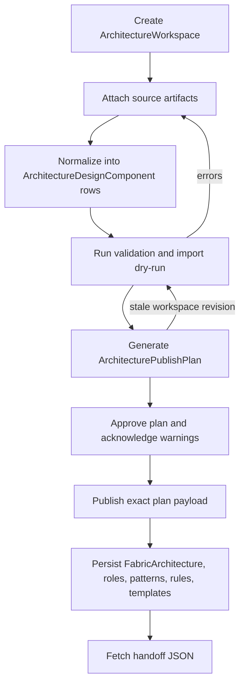

# First-Class Architecture Workspace

Last updated: 2026-05-22

The architecture workspace is the persistent operator/API workflow for turning
architecture design inputs into reusable multiplanar fabric blueprints. It sits
one layer above fabric onboarding: architecture workspaces publish architecture
semantics; onboarding workspaces instantiate those semantics for a site/fabric.

## Goals

1. Capture architecture source artifacts from blueprint bundles, schema JSON,
   stamp-template JSON, diagrams, spreadsheets, manual entries, notes, or API
   payloads.
2. Normalize those inputs into typed architecture components with provenance.
3. Validate the candidate blueprint through the executable architecture schema,
   blueprint parameter schema, device-type compatibility checks, and
   import/reconcile dry-run.
4. Generate stable-hash publish plans that can be approved, replayed, and
   applied exactly.
5. Publish through the same `fabric_architecture_blueprint` import path used by
   import preview/apply, so `FabricArchitecture`, child architecture rows, and
   stamp templates stay consistent.
6. Produce handoff JSON for downstream automation and audit review.

## Operator Workflow

## Data Model

`ArchitectureWorkspace`
: Durable container for a new blueprint, new version, revision, or comparison
  effort. It stores target slug/version, fabric class, optional base
  architecture, optional published architecture, current plan, summary JSON,
  owner/creator, status, and metadata.

`ArchitectureSourceArtifact`
: Durable source reference or pasted payload. The first slice supports JSON
  payloads directly and leaves room for richer spreadsheet/diagram parsing.

`ArchitectureDesignComponent`
: Normalized architecture component row. Current component kinds include
  `fabric_architecture_blueprint`, `architecture_role`, `transfer_pattern`,
  `allocation_rule_set`, `parameter_schema`, `required_device_types`, and
  `stamp_template`.

`ArchitectureValidationRun`
: Durable validation/audit record containing status, summary, issues, workspace
  revision, and import dry-run output.

`ArchitecturePublishPlan`
: Stable-hash publish artifact containing the exact `publish_payload`,
  validation summary, import plan, approval metadata, publish result, and
  lifecycle status.

## Source Normalization

Current parser keys:

- `mpf_blueprint_bundle`
- `architecture_schema_json`
- `stamp_template_json`
- `manual_component`
- `generic_json`

`generic_json` auto-detects blueprint bundles, architecture schema payloads,
and manual component item lists. Normalization is idempotent per
workspace/kind/natural-key and updates existing components instead of creating
duplicates.

For the operator-facing preparation guide, including the exact meaning of the
`Blueprint Bundle` artifact type and the `JSON Payload` input field, see
`docs/v2_architecture_workspace_payloads.md`.

## Validation And Publish

Validation runs these gates:

1. build a `fabric_architecture_blueprint` import payload from normalized
   components or an optional base architecture,
2. run import/reconcile in dry-run mode,
3. parse the architecture definition,
4. validate architecture schema invariants,
5. validate blueprint parameter schema,
6. check required device-type compatibility and record missing device types as
   warnings instead of hard errors.

Publish plans are blocked only by errors. Warnings require explicit approval
acknowledgement. Applying a plan calls `reconcile_import_payload(...,
apply=True)`.

## UI Surface

The NetBox menu exposes `Build & Run -> Architecture Workspaces`.

The workspace detail page includes:

- attach source artifact form,
- source list with normalize actions,
- normalized component inventory,
- validation-run history,
- publish-plan history,
- validate, generate publish plan, publish current plan, and handoff JSON
  actions.

Publish-plan detail pages include approval/publish controls plus validation and
import-plan summaries.

## REST Surface

Registry CRUD/API endpoints exist for all architecture workspace models. The
workflow endpoints are:

- `POST /api/plugins/plant-graph/architecture-workspaces/<id>/sources/`
- `POST /api/plugins/plant-graph/architecture-source-artifacts/<id>/normalize/`
- `POST /api/plugins/plant-graph/architecture-workspaces/<id>/validate/`
- `POST /api/plugins/plant-graph/architecture-workspaces/<id>/plans/generate/`
- `POST /api/plugins/plant-graph/architecture-publish-plans/<id>/approve/`
- `POST /api/plugins/plant-graph/architecture-publish-plans/<id>/publish/`
- `POST /api/plugins/plant-graph/architecture-workspaces/<id>/publish/`
- `GET /api/plugins/plant-graph/architecture-workspaces/<id>/handoff.json`

See `docs/v2_external_contracts.md` for the stable top-level response keys.

## Current Limitations

1. Spreadsheet and diagram parsing are represented as artifact types but still
   require parser implementations.
2. Device-type compatibility is advisory for architecture publication because
   architecture design often precedes local NetBox device-type population.
3. The first slice publishes one canonical architecture blueprint item per
   workspace; side-by-side multi-blueprint workspaces should be modeled as
   separate workspaces for now.
4. Handoff JSON is intentionally source/plan oriented and does not yet package
   binary source artifacts.

## Verification

Focused coverage lives in
`netbox_plant_graph/tests/test_v2_architecture_workspace.py` and validates:

- source attach/normalize,
- component creation,
- validation run creation,
- publish-plan generation/approval/publish,
- API workflow endpoints,
- workspace detail rendering,
- handoff JSON.
