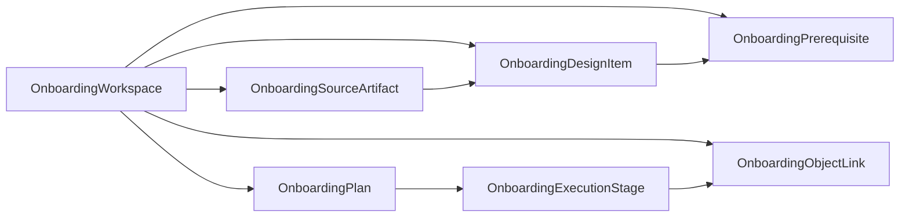
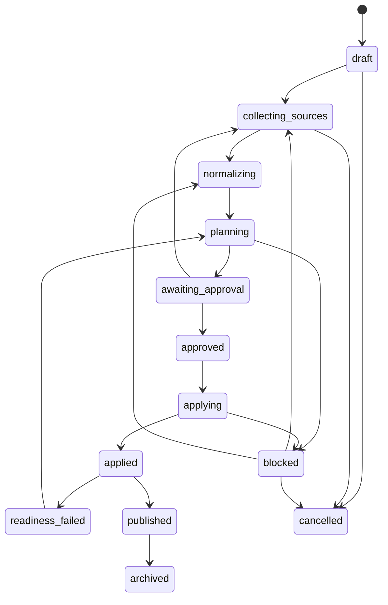

# First-Class Onboarding Workspace Design

Last updated: 2026-05-22

This document records the first-class onboarding workspace design and the
implemented first slice that makes the desired multi-planar RoCE fabric
onboarding workflow executable inside NetBox and the
`netbox_multiplanar_fabrics` plugin.

The workspace is the orchestration layer that turns today's separate surfaces
into one guided process:

- architecture blueprint selection/import,
- site design document capture,
- direct UI/API entry for missing design data,
- staged design inventory,
- prerequisite resolution,
- unified plan generation,
- staged apply,
- readiness audit,
- publish/handoff artifacts,
- future drift and planned-change tracking.

Architecture design is now handled by the separate first-class architecture
workspace. Use architecture workspaces to publish reusable blueprints and
onboarding workspaces to instantiate one of those blueprints into a concrete
fabric/site deployment.

## Goals

1. Give every net-new fabric onboarding effort a persistent workspace.
2. Treat site design documents and direct UI/API entry as equivalent sources of
   staged design data.
3. Normalize incoming data before mutating NetBox or plugin topology rows.
4. Generate one auditable onboarding plan that composes V2.5 stamp preview,
   import preview, prerequisite resolution, readiness checks, and handoff
   artifacts.
5. Apply onboarding plans in explicit stages with retry, resume, and rollback
   context.
6. Publish a fabric only when readiness criteria pass or approved exceptions
   exist.
7. Preserve provenance from source documents/manual entries to applied objects.

## Implementation Status

The first operational slice is implemented in the plugin:

- persistent onboarding models:
  `OnboardingWorkspace`, `OnboardingSourceArtifact`, `OnboardingDesignItem`,
  `OnboardingPrerequisite`, `OnboardingPlan`, `OnboardingExecutionStage`, and
  `OnboardingObjectLink`;
- registry-backed CRUD/API list/detail surfaces for those models;
- `Build & Run -> Onboarding Workspaces` navigation with a workspace detail
  control surface;
- source artifact attach and normalize actions for JSON source references,
  `.mpf`-style blueprint bundles, import-reconcile JSON, and manual/API design
  rows;
- prerequisite discovery/resolution actions with bind/create/defer/not-required
  modes;
- stable-hash onboarding plan generation that composes prerequisite state,
  V2.5 stamp preview, import reconciliation dry-run, readiness projection,
  retry preview, rollback preview, issues, and next actions;
- plan approval/apply actions with ordered execution stages;
- readiness, publish, and handoff JSON actions;
- REST workflow endpoints matching the UI actions.

The remaining gaps are now follow-on polish rather than missing foundation:
spreadsheet/diagram parsers, planned-graph audit simulation before commit,
deeper prerequisite creation forms, richer remediation queues, and visual
handoff/export packaging.

## Non-Goals For First Slice

1. Full spreadsheet or diagram parsing for arbitrary file formats.
2. Replacing NetBox's native inventory pages for core objects.
3. A generic graph simulation engine that perfectly audits uncommitted topology.
4. A document-management system with binary file lifecycle ownership.
5. Automatic remediation of every import/audit conflict.

The first slice should support referenced source artifacts, uploaded/pasted JSON
payloads, `.mpf-blueprint.json` bundles, and operator-entered staged rows. Rich
file parsers can be added after the workspace exists.

## Current Building Blocks

The workspace should reuse, not replace, these current surfaces:

- `preview_stamp_template_v25(...)`
- `apply_stamp_template_v25(...)`
- `rollback_stamp_run_v25(...)`
- `classify_stamp_retry_v25(...)`
- `reconcile_import_payload(...)`
- `mpf_import_reconcile`
- `mpf_check_blueprint_compatibility`
- `audit_topology_integrity(...)`
- `persist_topology_integrity_report(...)`
- `model_operational_impact(...)`
- `persist_operational_impact_report(...)`
- `OperationRun`
- `StampRun`
- `AuditEvent`
- generated V2 object CRUD/API registry

## Conceptual Model



The workspace is the durable container. Source artifacts and direct-entry rows
feed staged design items. Staged items generate prerequisite requirements and a
unified onboarding plan. Plan execution produces stage records and object links
back to applied NetBox/plugin objects.

## Proposed Data Model

### OnboardingWorkspace

Purpose: one durable onboarding effort for one intended fabric or fabric change.

Suggested fields:

- `name`: human-readable workspace name.
- `slug`: unique workspace slug.
- `status`: workspace lifecycle status.
- `fabric_class`: choice aligned with `FabricClassChoices`.
- `target_fabric_name`: intended fabric name before a `Fabric` exists.
- `target_fabric_slug`: intended fabric slug before a `Fabric` exists.
- `fabric`: nullable FK to `Fabric`, populated once created/stamped.
- `architecture`: nullable FK to `FabricArchitecture`.
- `site`: nullable FK to NetBox `Site`.
- `location`: nullable FK to NetBox `Location`.
- `tenant`: nullable FK to NetBox `Tenant`.
- `created_by`: nullable FK to auth user.
- `owner`: nullable FK to auth user or future team object.
- `current_plan`: nullable FK to latest `OnboardingPlan`.
- `source_summary`: JSON cache of source counts and hashes.
- `readiness_summary`: JSON cache of readiness status.
- `metadata`: JSON for extension data.

Suggested constraints:

- unique `slug`.
- unique active workspace per `target_fabric_slug` unless archived/cancelled.

Suggested statuses:

- `draft`
- `collecting_sources`
- `normalizing`
- `planning`
- `blocked`
- `awaiting_approval`
- `approved`
- `applying`
- `applied`
- `readiness_failed`
- `published`
- `archived`
- `cancelled`

### OnboardingSourceArtifact

Purpose: durable reference to a source artifact used by the workspace.

Suggested fields:

- `workspace`: FK to `OnboardingWorkspace`.
- `artifact_type`: `blueprint_bundle`, `spreadsheet`, `diagram`, `cable_schedule`,
  `rack_plan`, `bom`, `manual_entry`, `api_payload`, `note`, `other`.
- `name`: display name.
- `source_uri`: optional external URI/path.
- `uploaded_file`: optional NetBox/Django file field if local storage is
  enabled for this plugin.
- `content_sha256`: optional content hash.
- `payload_version`: optional source/payload version.
- `source_label`: operator-provided label.
- `parser_key`: parser/normalizer used.
- `status`: `received`, `normalized`, `failed`, `superseded`, `ignored`.
- `raw_payload`: JSON for pasted JSON or extracted text metadata.
- `parse_result`: JSON summary of parsing/normalization.
- `metadata`: JSON extension data.

First-slice implementation can omit binary upload and support only
`source_uri`, pasted JSON, and file-upload text payloads. The model should leave
room for binary files later.

### OnboardingDesignItem

Purpose: normalized staged design row before mutation.

Suggested fields:

- `workspace`: FK to `OnboardingWorkspace`.
- `source_artifact`: nullable FK to `OnboardingSourceArtifact`.
- `kind`: import/stamp/prerequisite kind, such as `fabric_architecture_blueprint`,
  `stamp_parameters`, `cable_assembly`, `fiber_strand_cable`, `endpoint`,
  `transport_channel`, `transport_channel_position_map`, `strand_termination`,
  `netbox_site`, `netbox_device`, `netbox_interface`, or `manual_note`.
- `natural_key`: stable string identity within the workspace.
- `desired_state`: JSON normalized desired object state.
- `provenance`: JSON with source row, sheet, diagram object, field path, API
  caller, or manual-entry actor.
- `validation_status`: `pending`, `valid`, `warning`, `conflict`, `ignored`.
- `validation_messages`: JSON list of row-level issues.
- `planned_object_type`: nullable content type for target object model.
- `planned_object_id`: nullable object ID after bind/apply.
- `metadata`: JSON extension data.

Suggested constraints:

- unique `workspace`, `kind`, `natural_key`.

Design items should be treated as workspace-owned staged state. Applying a plan
should create/update real NetBox/plugin objects, not mutate topology directly
from the item table.

### OnboardingPrerequisite

Purpose: explicit requirement discovered during planning.

Suggested fields:

- `workspace`: FK to `OnboardingWorkspace`.
- `design_item`: nullable FK to the item that produced this requirement.
- `requirement_key`: stable natural key.
- `object_model`: string model label, such as `dcim.device_type`.
- `role`: semantic role, such as `gpu_tray`, `leaf_switch`, `site`,
  `device_role`, `source_device`, `osfp_interface`.
- `desired_identity`: JSON lookup fields.
- `resolution_mode`: `unresolved`, `bind`, `create`, `defer`, `not_required`.
- `resolved_object_type`: nullable content type.
- `resolved_object_id`: nullable object ID.
- `planned_create`: JSON create payload when mode is `create`.
- `defer_reason`: optional text.
- `status`: `open`, `resolved`, `deferred`, `blocked`.
- `metadata`: JSON extension data.

Suggested constraints:

- unique `workspace`, `requirement_key`.

### OnboardingPlan

Purpose: immutable or mostly immutable generated plan for one workspace
revision.

Suggested fields:

- `workspace`: FK to `OnboardingWorkspace`.
- `status`: `draft`, `generated`, `blocked`, `awaiting_approval`, `approved`,
  `applying`, `applied`, `failed`, `superseded`, `cancelled`.
- `plan_hash`: stable hash of plan inputs and plan payload.
- `workspace_revision`: integer or hash representing source/design state.
- `generated_by`: nullable user FK.
- `approved_by`: nullable user FK.
- `approved_at`: nullable datetime.
- `warning_acknowledgements`: JSON list of acknowledged warnings.
- `prerequisite_plan`: JSON.
- `stamp_preview`: JSON.
- `import_plan`: JSON.
- `audit_projection`: JSON.
- `impact_projection`: JSON.
- `readiness_projection`: JSON.
- `rollback_preview`: JSON.
- `retry_preview`: JSON.
- `plan_payload`: JSON full canonical plan envelope.
- `metadata`: JSON extension data.

Suggested constraints:

- unique `workspace`, `plan_hash`.

Important behavior:

- A plan should be regenerated when source artifacts, design items, prerequisite
  resolutions, or key workspace attributes change.
- Applying a plan should require that the accepted `plan_hash` still matches the
  current plan inputs.

### OnboardingExecutionStage

Purpose: track execution of one accepted plan stage.

Suggested fields:

- `plan`: FK to `OnboardingPlan`.
- `stage_key`: stable stage key.
- `stage_kind`: `prerequisites`, `architecture`, `stamp`, `import`,
  `readiness_audit`, `impact_reports`, `handoff`.
- `status`: `pending`, `running`, `completed`, `failed`, `skipped`,
  `rolled_back`.
- `started_at`
- `completed_at`
- `operation_run`: nullable FK to `OperationRun`.
- `stamp_run`: nullable FK to `StampRun`.
- `result`: JSON.
- `error_detail`: text.
- `metadata`: JSON extension data.

Suggested constraints:

- unique `plan`, `stage_key`.

### OnboardingObjectLink

Purpose: link workspace/plan/stage/design item/source artifact to applied
objects and generated reports.

Suggested fields:

- `workspace`: FK to `OnboardingWorkspace`.
- `plan`: nullable FK to `OnboardingPlan`.
- `stage`: nullable FK to `OnboardingExecutionStage`.
- `design_item`: nullable FK to `OnboardingDesignItem`.
- `source_artifact`: nullable FK to `OnboardingSourceArtifact`.
- `link_kind`: `applied_object`, `created_object`, `updated_object`,
  `bound_object`, `report`, `export`, `manual_reference`.
- `object_type`: nullable content type.
- `object_id`: nullable object ID.
- `label`: display label.
- `external_url`: optional URL for external documents/reports.
- `metadata`: JSON extension data.

This table is the bridge from site design documents and manual entries to real
objects in NetBox/plugin tables.

## State Machine



## Services

Create a new package:

```text
netbox_plant_graph/services/onboarding/
```

### workspace.py

Responsibilities:

- create/update workspaces,
- compute workspace revision,
- summarize source/design/prerequisite/plan state,
- enforce status transitions,
- emit `AuditEvent` records for material workflow changes.

Key functions:

- `create_onboarding_workspace(...)`
- `transition_workspace(workspace, status, actor=None, message='')`
- `workspace_revision(workspace) -> str`
- `workspace_summary(workspace) -> dict`

### sources.py

Responsibilities:

- attach source artifacts,
- compute payload/file hashes,
- store source references,
- supersede/ignore artifacts,
- expose parser selection.

Key functions:

- `attach_source_artifact(...)`
- `hash_source_payload(...)`
- `supersede_source_artifact(...)`

### normalizers.py

Responsibilities:

- normalize supported source artifact types into `OnboardingDesignItem` rows,
- preserve provenance,
- support pluggable parsers.

First supported normalizers:

- `mpf_blueprint_bundle`
- `import_reconcile_json`
- `manual_design_item`

Later normalizers:

- workbook cable schedule,
- rack plan spreadsheet,
- port map spreadsheet,
- diagram extract payload.

Key functions:

- `normalize_source_artifact(artifact, actor=None) -> NormalizationResult`
- `upsert_design_item(...)`

### prerequisites.py

Responsibilities:

- discover prerequisites from workspace, selected blueprint, stamp parameters,
  and design items,
- compare requirements against NetBox/plugin objects,
- produce explicit bind/create/defer decisions.

Key functions:

- `discover_prerequisites(workspace) -> PrerequisiteResult`
- `resolve_prerequisite(prerequisite, mode, object=None, planned_create=None)`
- `prerequisite_plan(workspace) -> dict`

### planner.py

Responsibilities:

- compose one plan from current workspace state,
- call V2.5 stamp preview when a stamp template is selected,
- call import reconciliation dry-run for staged import items,
- include prerequisite plan,
- include current-state or future planned-state readiness projection,
- hash the canonical plan.

Key functions:

- `generate_onboarding_plan(workspace, actor=None) -> OnboardingPlan`
- `canonical_plan_payload(workspace, ...) -> dict`
- `stable_plan_hash(payload) -> str`

First-slice planner can use current-state audit warnings and explicitly mark
pre-apply planned audit as `not_available`. Later slices can add planned graph
simulation.

### executor.py

Responsibilities:

- verify accepted plan hash,
- apply stages in order,
- persist `OnboardingExecutionStage` rows,
- call `apply_stamp_template_v25(...)`,
- call `reconcile_import_payload(..., apply=True)`,
- persist import/audit/impact `OperationRun` reports,
- record object links.

Key functions:

- `apply_onboarding_plan(plan, actor=None, stages=None) -> ExecutionResult`
- `apply_stage(stage, actor=None) -> StageResult`
- `resume_onboarding_plan(plan, actor=None)`

### readiness.py

Responsibilities:

- evaluate readiness from audit, import, stamp, impact, and coverage reports,
- produce publish/no-publish status,
- identify blocking criteria and approved exceptions.

Key functions:

- `evaluate_onboarding_readiness(workspace_or_plan) -> ReadinessResult`
- `publish_workspace(workspace, actor=None) -> PublishResult`

### handoff.py

Responsibilities:

- generate fabric handoff dossier payload,
- collect links to source artifacts, plan, stamp runs, import reports, audit
  reports, visual trace exports, and impact reports.

Key functions:

- `build_handoff_dossier(workspace) -> dict`
- `export_handoff_dossier(workspace) -> HttpResponse | dict`

## UI Design

### Navigation

Add under `Build & Run`:

- `Onboarding Workspaces`

Keep existing `Onboard Fabric` during transition, but treat it as a legacy-light
shortcut or redirect path once the workspace flow is usable.

### Workspace List

Columns:

- name,
- status,
- target fabric slug,
- site,
- blueprint,
- latest plan status,
- readiness status,
- updated time.

Filters:

- status,
- site,
- fabric class,
- architecture,
- owner,
- readiness status.

### Workspace Detail

Use tabs or cards:

1. `Overview`
2. `Sources`
3. `Design Inventory`
4. `Prerequisites`
5. `Plan`
6. `Execute`
7. `Readiness`
8. `Handoff`

#### Overview

Show workspace state, target site/fabric, selected blueprint, current plan,
source counts, open prerequisites, blocking findings, latest stage status, and
primary next action.

#### Sources

Actions:

- add source URI,
- upload/paste JSON payload,
- upload/import `.mpf-blueprint.json`,
- mark source ignored,
- supersede source,
- normalize source.

Display source hash, parser, parse status, generated design-item count, and
errors.

#### Design Inventory

Show staged items grouped by kind with row provenance, desired state summary,
validation status, and target object linkage.

Actions:

- add manual design item,
- edit staged item,
- ignore staged item,
- validate staged item,
- generate import payload preview.

#### Prerequisites

Show all open requirements with decision controls:

- bind to existing object,
- create object from planned payload,
- defer with reason,
- mark not required.

Each requirement should show which source/design item caused it.

#### Plan

Actions:

- generate plan,
- compare latest plan with previous,
- acknowledge warnings,
- approve plan,
- supersede plan.

Sections:

- prerequisite plan,
- stamp preview,
- import plan,
- audit/readiness projection,
- impact projection,
- rollback/retry posture,
- provenance summary.

#### Execute

Show staged execution records and stage controls:

- apply all,
- apply next stage,
- retry failed stage,
- resume plan,
- view stage result,
- view linked `StampRun`/`OperationRun`.

First-slice stage order:

1. prerequisites,
2. architecture/template import,
3. V2.5 stamp,
4. import reconciliation,
5. topology audit,
6. handoff dossier.

#### Readiness

Show readiness decision and inputs:

- latest topology integrity gate,
- blocking findings,
- import conflicts,
- stamp status,
- path/fanout coverage sampling,
- impact report sanity checks,
- approved exceptions/suppressions.

Actions:

- rerun readiness,
- open Audit Triage,
- request exception,
- publish when ready.

#### Handoff

Show exportable/persistent artifacts:

- source manifest,
- accepted plan,
- applied stage manifest,
- `StampRun` records,
- import reports,
- topology integrity reports,
- impact reports,
- visual trace exports or links,
- final fabric URL.

## API Design

Generated CRUD/API endpoints should be available for the new models through the
existing V2 registry.

Workflow endpoints:

```text
POST /api/plugins/plant-graph/onboarding-workspaces/
GET  /api/plugins/plant-graph/onboarding-workspaces/<id>/
POST /api/plugins/plant-graph/onboarding-workspaces/<id>/sources/
POST /api/plugins/plant-graph/onboarding-source-artifacts/<id>/normalize/
POST /api/plugins/plant-graph/onboarding-workspaces/<id>/prerequisites/discover/
POST /api/plugins/plant-graph/onboarding-prerequisites/<id>/resolve/
POST /api/plugins/plant-graph/onboarding-workspaces/<id>/plans/generate/
POST /api/plugins/plant-graph/onboarding-plans/<id>/approve/
POST /api/plugins/plant-graph/onboarding-plans/<id>/apply/
POST /api/plugins/plant-graph/onboarding-workspaces/<id>/readiness/
POST /api/plugins/plant-graph/onboarding-workspaces/<id>/publish/
GET  /api/plugins/plant-graph/onboarding-workspaces/<id>/handoff.json
```

Stable response envelopes should include:

- `workspace`
- `artifact`
- `prerequisite`
- `plan`
- `result`
- `summary`
- `issues`
- `next_actions`

## Plan Envelope

The canonical plan payload should be JSON-serializable and hash-stable.

Suggested top-level shape:

```json
{
  "schema": "v2.onboarding.plan/1",
  "workspace": {
    "id": 1,
    "slug": "mad1-roce-onboarding",
    "revision": "sha256:..."
  },
  "target": {
    "fabric_name": "mad1-roce",
    "fabric_slug": "mad1-roce",
    "fabric_class": "roce_backend",
    "site_id": 12,
    "architecture": {
      "slug": "roce-4-plane-gb300-2x2-shuffle",
      "version": "v2"
    }
  },
  "sources": [],
  "prerequisites": {
    "summary": {},
    "requirements": []
  },
  "stamp": {
    "template_id": 10,
    "preview": {}
  },
  "imports": {
    "payload": {},
    "plan": {}
  },
  "readiness_projection": {
    "status": "not_available",
    "reason": "planned graph simulation not implemented"
  },
  "rollback": {},
  "retry": {},
  "issues": [],
  "next_actions": []
}
```

## Provenance Strategy

Every source-derived or manually entered datum should retain provenance.

Minimum provenance fields:

- `source_artifact_id`
- `source_system`
- `source_document`
- `source_row`
- `source_field`
- `external_id`
- `idempotency_key`
- `entry_method`: `document`, `manual_ui`, `api`, `generated`
- `entered_by`
- `entered_at`

Applied object links should preserve provenance in two ways:

1. `OnboardingObjectLink` rows map source/design items to real objects.
2. Applied object `metadata` may store lightweight provenance references where
   the target model already supports metadata.

## Interaction With Existing Workflows

### FabricOnboardView

Short term:

- keep the current view,
- add a "create onboarding workspace" path for new fabrics,
- link created fabrics back to a workspace when one exists.

Long term:

- make the current view a shortcut that creates a workspace and jumps to the
  workspace `Overview`.

### Import Preview

Short term:

- allow saved import reports to be linked to a workspace.
- allow Import Preview to load staged design items from a workspace.

Long term:

- move import preview into the workspace `Plan` tab as one plan section.

### Stamp Template Execute

Short term:

- allow stamp preview/apply to accept optional `workspace_id`.
- write workspace links to `StampRun.metadata`.

Long term:

- execute stamp templates primarily through accepted onboarding plans.

### Operations Center

Short term:

- show recent onboarding workspaces and blocked/pending plans.

Long term:

- make Operations Center the overview of active onboarding, readiness, import,
  audit, and impact work.

## Implementation Slices

### Slice 0: Choices and model foundation

Deliver:

- choice classes for workspace, artifact, design item, prerequisite, plan, and
  stage statuses,
- models and migration,
- basic admin/registry/API registration,
- simple string representations and `get_absolute_url` routes.

Focused tests:

- model creation,
- uniqueness constraints,
- status choices,
- registry route generation.

### Slice 1: Workspace shell UI

Deliver:

- `OnboardingWorkspaceListView`,
- `OnboardingWorkspaceView`,
- create/edit forms,
- Build & Run navigation entry,
- overview tab with current summaries.

Focused tests:

- menu link resolves,
- list/detail render,
- create form creates workspace,
- permissions use existing NetBox/plugin permission behavior.

### Slice 2: Source artifacts and normalizers

Deliver:

- source artifact add/list actions,
- pasted JSON and `.mpf-blueprint.json` bundle support,
- normalizer service that creates design items,
- provenance fields on design items.

Focused tests:

- source hash stability,
- JSON payload normalization,
- blueprint bundle normalization,
- provenance preservation.

### Slice 3: Design inventory and prerequisite resolver

Deliver:

- design inventory tab,
- manual design item entry,
- prerequisite discovery,
- prerequisite bind/create/defer UI,
- prerequisite plan JSON.

Focused tests:

- missing `Site`/`DeviceType` requirements are discovered,
- bind/create/defer transitions work,
- prerequisite summaries are deterministic.

### Slice 4: Unified plan generation

Deliver:

- `generate_onboarding_plan(...)`,
- plan tab,
- plan hash,
- stamp preview section,
- import dry-run section,
- prerequisite section,
- current-state readiness warning section,
- warning acknowledgement and approval.

Focused tests:

- plan generated from workspace state,
- plan hash changes when inputs change,
- blocking stamp/import issues block approval,
- approved plan cannot be applied after workspace revision changes.

### Slice 5: Staged plan execution

Deliver:

- execution stages,
- apply next/apply all,
- V2.5 stamp stage,
- import reconciliation stage,
- operation/stamp run linking,
- retry failed stage.

Focused tests:

- stage order is enforced,
- stamp/import calls are invoked with expected payloads,
- failures preserve resume point,
- successful stages create object links.

### Slice 6: Readiness and publish

Deliver:

- readiness evaluator,
- topology integrity audit stage,
- publish action,
- handoff dossier JSON,
- Operations Center summary.

Focused tests:

- blocking audit findings prevent publish,
- approved exceptions can unblock readiness according to policy,
- publish sets workspace and fabric status,
- handoff dossier includes expected artifacts.

### Slice 7: API and documentation hardening

Deliver:

- workflow API endpoints,
- examples under `docs/examples/`,
- external contract labels,
- runbook updates,
- focused API tests.

## Minimal MVP Definition

The smallest useful first-class workspace should include:

1. `OnboardingWorkspace`
2. `OnboardingSourceArtifact`
3. `OnboardingDesignItem`
4. `OnboardingPlan`
5. source JSON normalization into staged design items,
6. plan generation that combines V2.5 stamp preview and import dry-run,
7. plan approval,
8. staged apply for stamp and import,
9. topology audit after apply,
10. links to resulting `StampRun` and `OperationRun` records.

This MVP does not need full planned-graph audit simulation or arbitrary
spreadsheet parsing. It must, however, preserve provenance and create the
workspace spine that all later features attach to.

## Migration Notes

Suggested next migration:

```text
0006_onboarding_workspace.py
```

Migration should only add new tables and choices. It should not alter current
fabric, stamp, import, audit, or impact tables except optional nullable backrefs
if we decide they are worth adding. Prefer `OnboardingObjectLink` over adding
many nullable FK columns to existing models.

## Test Strategy

Use focused tests, not the full suite, while building slices:

- `test_v2_onboarding_models.py`
- `test_v2_onboarding_sources.py`
- `test_v2_onboarding_prerequisites.py`
- `test_v2_onboarding_planner.py`
- `test_v2_onboarding_executor.py`
- `test_v2_onboarding_ui.py`
- `test_v2_onboarding_api.py`

Golden-path fixture:

1. create workspace,
2. attach blueprint/import JSON source,
3. normalize to design items,
4. resolve prerequisites by binding test objects,
5. generate plan,
6. approve plan,
7. apply stamp/import stages,
8. run readiness,
9. publish.

Failure fixtures:

- stale plan hash,
- missing site,
- missing device type,
- import conflict,
- stamp preview error,
- failed execution stage,
- audit finding blocks publish.

## Open Design Decisions

1. Should source artifacts support actual file upload in the first slice, or only
   external URI plus pasted JSON?
2. Should plan approval require a second user, or can the creator approve in
   early V2?
3. Should publishing set `Fabric.status='active'`, or should publish only mark
   the workspace and require explicit fabric activation?
4. Should workspace lifecycle support changes to an existing fabric from day
   one, or only net-new fabric onboarding?
5. Should staged design items be editable after a plan is approved, or should
   edits always supersede the plan first?

## Recommended First Implementation Wave

Build in this order:

1. models/choices/migration/registry,
2. workspace list/detail/create UI,
3. source artifact and JSON normalization,
4. staged design item inventory,
5. plan generation from existing stamp/import preview services,
6. approval plus plan-hash lock,
7. staged apply for stamp/import,
8. readiness audit and publish placeholder.

That sequence creates the spine quickly, then wires in the already mature
services without forcing a big-bang rewrite.
