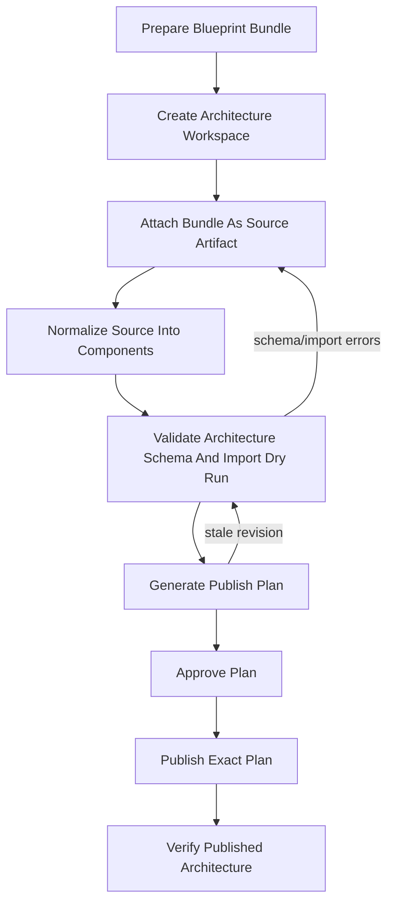
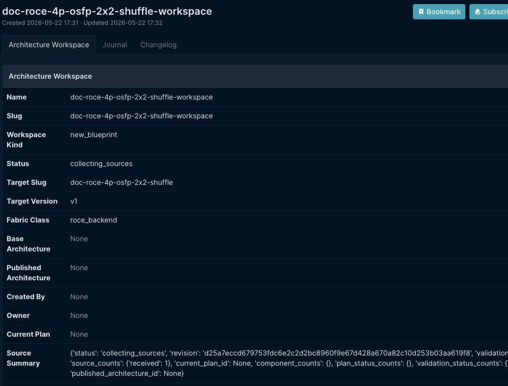
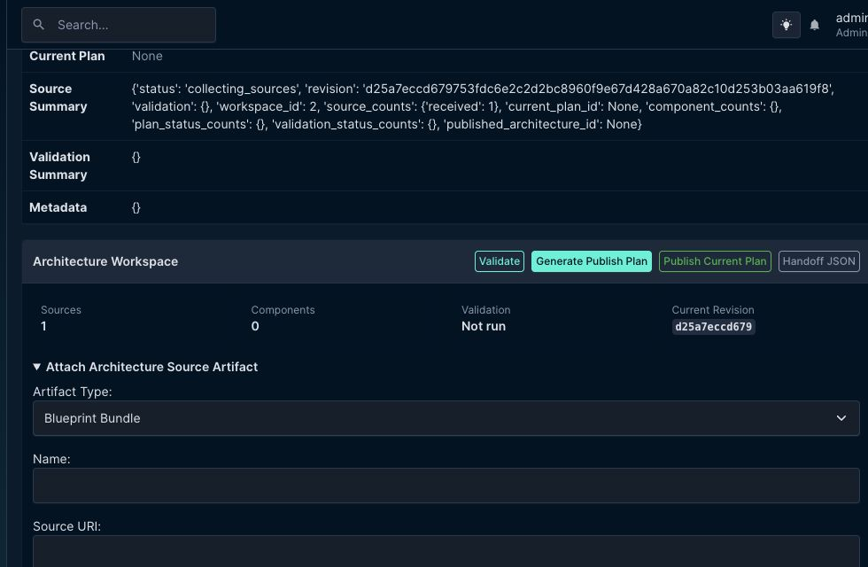
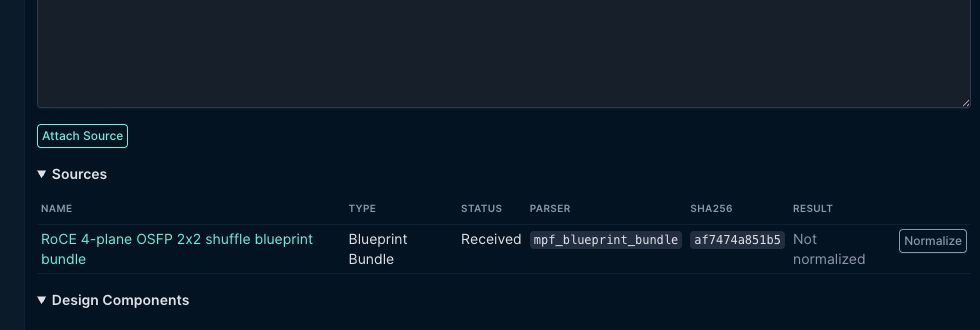
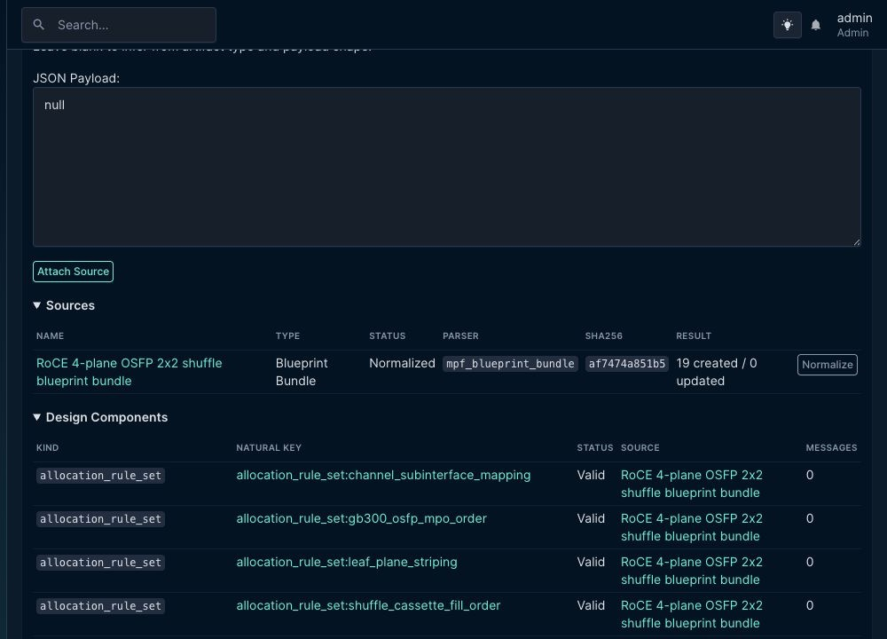
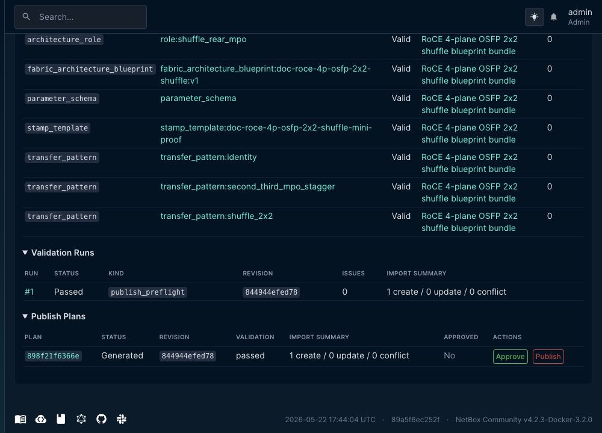
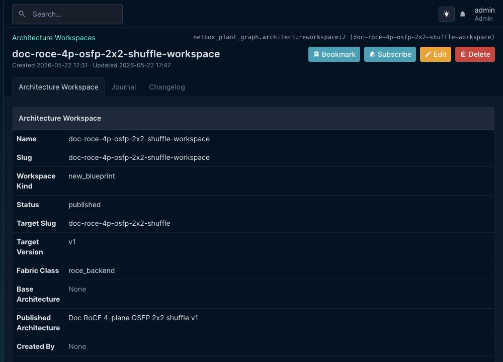
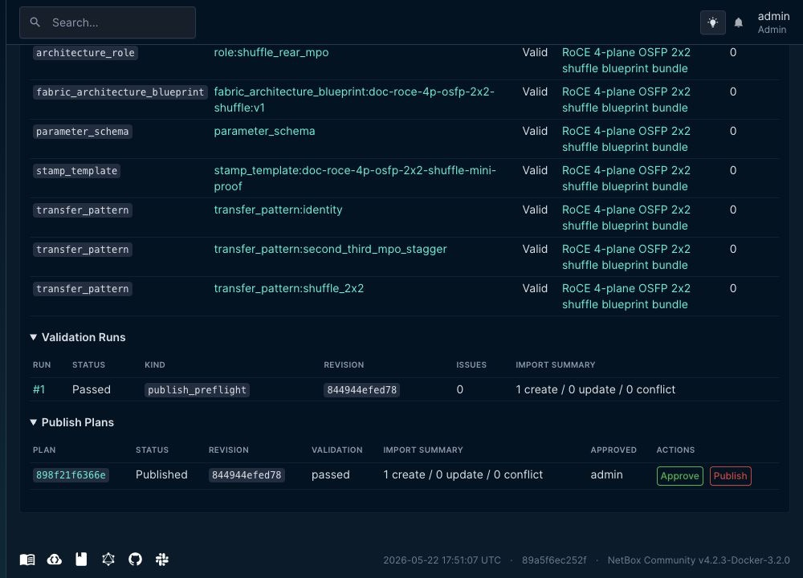
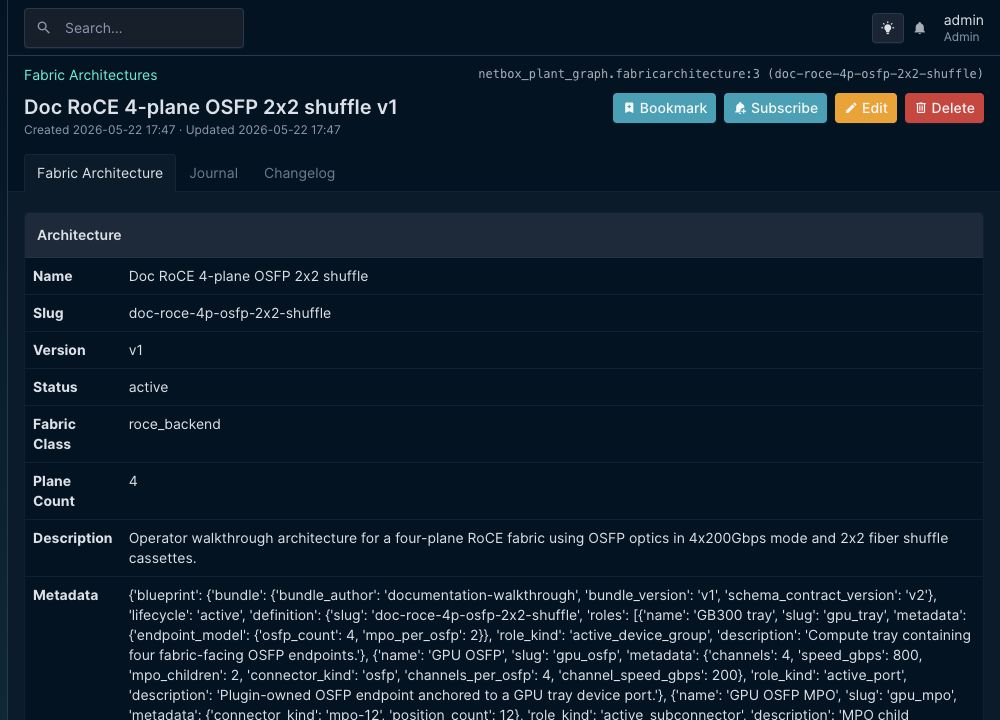

# RoCE 4-Plane 2x2 Shuffle Architecture Walkthrough

Last updated: 2026-05-22

This is the operator walkthrough for creating an architecture definition for a
four-plane RoCE fabric with 2x2 fiber shuffle cassettes and OSFP optics in
4x200Gbps mode.

It is a companion to `docs/v2_architecture_workspace_payloads.md`. That document
defines the accepted source payload formats. This document walks through one
complete architecture workspace run and shows what the operator should expect
to see in NetBox.

The screenshots below were captured from the local NetBox development instance
while executing this walkthrough end to end.

## Architecture Target

The architecture produced by this walkthrough represents:

- a RoCE backend fabric;
- four network planes;
- OSFP endpoint optics operating as four 200Gbps Ethernet interfaces;
- two MPO12 connectors per OSFP;
- active MPO positions `1, 12, 2, 11` and `3, 10, 4, 9`;
- dark MPO positions `5, 6, 7, 8`;
- a channel map where:
  - MPO 1 positions `1, 12, 2, 11` map to 200Gbps interface 1;
  - MPO 1 positions `3, 10, 4, 9` map to 200Gbps interface 2;
  - MPO 2 positions `1, 12, 2, 11` map to 200Gbps interface 3;
  - MPO 2 positions `3, 10, 4, 9` map to 200Gbps interface 4;
- 2x2 shuffle groups `1-2` and `3-4`;
- a published stamp template bound to the same architecture slug and version.

The walkthrough uses the built-in
`roce-4-plane-gb300-2x2-shuffle` blueprint as the starting point, then publishes
a site/operator-authored copy through an architecture workspace. That is the
recommended path when the desired architecture is close to a built-in registry
blueprint but needs a controlled lifecycle, provenance, and handoff JSON.

## Flow



## Step 1: Prepare The Blueprint Bundle

Start from the built-in registry blueprint and produce a new bundle with the
operator-owned slug/version. For this walkthrough, the published architecture is:

```text
slug: doc-roce-4p-osfp-2x2-shuffle
version: v1
fabric_class: roce_backend
plane_count: 4
```

The generated bundle contains:

- `definition`: the executable architecture schema;
- `parameter_schema`: stamp-time parameters for later fabric instantiation;
- `required_device_types`: left empty in this walkthrough so validation does
  not depend on local `DeviceType` population;
- `stamp_templates`: a mini-proof template rewritten to point at the new
  architecture slug/version;
- `schema_contract_version`: `v2`.

Use this shape from a NetBox shell as a reliable starting point:

```python
import json
from dataclasses import replace

from netbox_plant_graph.services.architecture_schema import ARCHITECTURE_SCHEMA_CONTRACT_VERSION
from netbox_plant_graph.services.blueprint_registry import (
    architecture_definition_to_payload,
    get_default_blueprint_registry,
)

slug = "doc-roce-4p-osfp-2x2-shuffle"
version = "v1"

entry = get_default_blueprint_registry().get_blueprint(
    "roce-4-plane-gb300-2x2-shuffle",
    "v2",
)

definition = replace(
    entry.definition,
    slug=slug,
    version=version,
    required_device_types={},
)

bundle = {
    "schema_contract_version": ARCHITECTURE_SCHEMA_CONTRACT_VERSION,
    "bundle_version": version,
    "bundle_author": "network-architecture",
    "name": "Doc RoCE 4-plane OSFP 2x2 shuffle",
    "description": (
        "Operator walkthrough architecture for a four-plane RoCE fabric using "
        "OSFP optics in 4x200Gbps mode and 2x2 fiber shuffle cassettes."
    ),
    "status": "active",
    "definition": architecture_definition_to_payload(definition),
    "parameter_schema": definition.parameter_schema,
    "required_device_types": {},
    "stamp_templates": {
        f"{slug}-mini-proof": {
            **entry.stamp_templates["roce-4-plane-mini-proof"],
            "slug": f"{slug}-mini-proof",
            "name": "Doc RoCE 4-plane mini proof",
            "template": {
                **entry.stamp_templates["roce-4-plane-mini-proof"]["template"],
                "architecture_slug": slug,
                "architecture_version": version,
            },
        }
    },
}

print(json.dumps(bundle, indent=2, sort_keys=True))
```

If the operator is defining the architecture from scratch instead of starting
from the registry, they must still provide the same inner schema surfaces:
roles, transfer patterns, allocation rule sets, channel map matrix, active/dark
MPO positions, plane count, fabric class, and any custom validator/provider
metadata.

## Step 2: Create The Architecture Workspace

Open `Build & Run -> Architecture Workspaces`, then create a workspace.

Recommended fields:

| Field | Value |
| --- | --- |
| `Name` | Human-readable workspace name |
| `Slug` | Stable workspace slug |
| `Workspace kind` | `New Blueprint` |
| `Status` | `Draft` |
| `Target slug` | Architecture slug to publish |
| `Target version` | Architecture version to publish |
| `Fabric class` | `RoCE Backend` |

In the walkthrough run, the workspace was created with:

```text
name: doc-roce-4p-osfp-2x2-shuffle-workspace
target_slug: doc-roce-4p-osfp-2x2-shuffle
target_version: v1
fabric_class: roce_backend
```



## Step 3: Attach The Bundle As A Source Artifact

On the workspace detail page, open `Attach Architecture Source Artifact`.

Use:

| Field | Value |
| --- | --- |
| `Artifact Type` | `Blueprint Bundle` |
| `Name` | A source name operators can recognize |
| `Payload Version` | Bundle/source version, for example `v1` |
| `Source Label` | Document, ticket, or design-package label |
| `Parser Key` | Leave blank unless intentionally overriding parser selection |
| `JSON Payload` | Paste the complete bundle JSON |

The UI field `JSON Payload` is the raw JSON input field. For this artifact type,
it should contain the full blueprint bundle object.



After attaching, the source appears in the `Sources` table as a received
`Blueprint Bundle` using parser `mpf_blueprint_bundle`.



## Step 4: Normalize The Source Artifact

Click `Normalize` on the source artifact row.

Normalization converts the raw bundle into durable
`ArchitectureDesignComponent` rows. For this architecture, normalization
produced 19 components:

- 1 `fabric_architecture_blueprint`;
- 9 `architecture_role` rows;
- 3 `transfer_pattern` rows;
- 4 `allocation_rule_set` rows;
- 1 `parameter_schema` row;
- 1 `stamp_template` row.

Every generated row should show `Valid` before moving on. If a component shows
`Conflict`, inspect the component detail page and fix the source bundle before
validation.



## Step 5: Validate The Workspace

Click `Validate`.

Validation runs the architecture schema checks and an import/reconcile dry run.
For the walkthrough bundle, validation passed with:

```text
issues: 0
import dry run: 1 create / 0 update / 0 conflict
```

Validation is the gate that answers whether the plugin can trust the
architecture as executable topology data. For this architecture, the important
validated semantics are:

- four-plane RoCE backend fabric class;
- OSFP role metadata for 4x200Gbps channels;
- two MPO12 children per OSFP;
- active/dark MPO position coverage;
- contiguous channel map matrix;
- 2x2 shuffle transfer geometry;
- stamp template targeting the same slug/version.

## Step 6: Generate A Publish Plan

Click `Generate Publish Plan`.

The publish plan captures the exact payload that will be applied. Do not treat
the workspace as publishable just because validation passed; the plan is the
stable artifact operators approve and replay.

The walkthrough generated a plan with one create operation and no conflicts.



## Step 7: Approve And Publish

Approve the generated plan. If validation produced warnings, acknowledge them
explicitly only after reviewing the warning details.

Then publish the approved plan.

Publishing applies the plan through the same import/reconcile path used by
saved import reports. For this walkthrough, publication created:

- one active `FabricArchitecture`;
- child `ArchitectureRole`, `TransferPattern`, and `AllocationRuleSet` rows;
- one `StampTemplate` attached to the published architecture.

After publication, the workspace status becomes `published` and the workspace
links to the published architecture.



The publish-plan row also moves to `Published` and records the approver.



## Step 8: Verify The Published Architecture

Open the linked architecture from the workspace or from
`Model Inventory -> Architectures`.

The published architecture should show:

```text
name: Doc RoCE 4-plane OSFP 2x2 shuffle
slug: doc-roce-4p-osfp-2x2-shuffle
version: v1
status: active
fabric_class: roce_backend
plane_count: 4
```



At this point, the architecture is available to downstream onboarding and V2.5
stamping workflows.

## Operator Checklist

Before using the architecture for fabric onboarding, confirm:

- the architecture slug/version match the intended site design contract;
- validation has passed with no errors;
- import dry-run has no conflicts;
- the published architecture is active;
- the channel map matrix matches the OSFP 4x200Gbps lane plan;
- the 2x2 shuffle transfer pattern is present;
- the stamp template points at the new architecture slug/version;
- any required device-type matrix is either populated correctly or intentionally
  empty because device-type binding will be handled later.

## What This Walkthrough Does Not Do

This walkthrough publishes reusable architecture semantics. It does not:

- instantiate a fabric;
- create devices, interfaces, MPO connectors, cable assemblies, strands, or
  optical lanes;
- import a site-specific cable plant;
- run fabric readiness audit against a deployed topology.

Those are onboarding/stamping responsibilities. Use this architecture as the
input contract for those later workflows.
