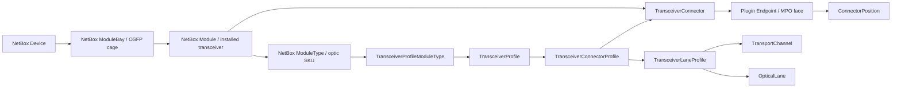

# V2 Transceiver Modeling Reference And Roadmap

Date: 2026-05-24

Status: first-class transceiver modeling is now part of the current V2 codebase.
The model/CRUD/API foundation is in place, V2.5 stamping/import execution can
install NetBox modules and bind plugin `TransceiverConnector` rows, Interface
Fanout Trace exposes transceiver context, and OSFP-unseat impact modeling uses
those bindings when present. Sections below that say "Target" or "Remaining"
describe the next polish layer rather than current required behavior.

## Decision

Use NetBox-native module inventory for the physical instantiation layer:

- NetBox `ModuleBay` / `ModuleBayTemplate` represents the physical OSFP cage.
- NetBox `ModuleType` represents the vendor transceiver/optic SKU.
- NetBox `Module` represents the actual installed transceiver instance.
- The plugin owns the fabric-specific optical semantics layered onto those
  NetBox objects: connector faces, polish, MPO position geometry, channel maps,
  optical lane maps, and compatibility rules.

This is pre-release code. We should optimize for the clean target model rather
than preserving legacy interface-anchored assumptions. Existing stamped data can
be refreshed after the model lands.

## Goal

Make installed optical transceivers in GB300 trays, backend leaf switches,
backend spine switches, and related OSFP cages first-class participants in the
fabric graph.

The plugin should be able to answer:

- which transceiver module is installed in a given OSFP cage,
- which transceiver profile applies to that module type,
- which optical connector faces the transceiver exposes,
- whether those faces are MPO8/MPO12/LC, APC/UPC, pinned/unpinned, etc.,
- which 200Gbps channels and optical lanes map to which connector positions,
- whether the connected cable assemblies are compatible with the installed
  transceiver,
- and what endpoints are impacted by transceiver unseat/failure.

## Current State

The plugin now uses a hybrid transceiver model:

- NetBox `ModuleBay`, `ModuleType`, and `Module` rows represent the physical
  OSFP cage, optic SKU, and installed transceiver.
- Plugin `TransceiverProfile`, `TransceiverConnectorProfile`,
  `TransceiverLaneProfile`, and `TransceiverConnector` rows represent the
  fabric-specific optical semantics NetBox cannot express.
- Plugin `TransceiverProfileModuleType` rows map semantic profiles to NetBox
  `ModuleType` SKUs with optional role hints and default flags.
- Built-in Madison/NVL72 profiles are seeded by
  `ensure_builtin_transceiver_profiles()`, including the default
  `osfp-dual-mpo12-apc-800g-4x200g-dr4` profile and known OSFP/QSFP module
  part-number mappings.
- V2.5 stamping can create module bays/modules for stamped OSFP endpoints and
  bind each installed module to the plugin child MPO endpoints.
- Import reconciliation accepts `transceiver_assignment` rows for exact-plan
  preview/apply of module/profile/connector bindings.
- Rollback manifests include plugin transceiver connector bindings, so V2.5
  compensation can remove stamped endpoint trees without protected FK blockers.
- Registry-backed CRUD and REST endpoints exist for profiles, module-type
  mappings, connector profiles, lane profiles, and installed connector
  bindings.

The interface-anchored behavior still exists as a compatibility and operator
selection convenience around the newer transceiver bindings:

- NetBox `Interface` rows represent physical OSFP-ish ports such as `osfp1` or
  `swp32`.
- Plugin `Endpoint` rows anchor to those interfaces.
- Child plugin `Endpoint` rows represent local MPO connector faces such as
  `MPO-1` and `MPO-2`.
- `TransportChannel` and `TransportChannelPositionMap` model 200Gbps child
  interface/channel mappings onto MPO positions.
- `OpticalLane` represents endpoint-local signaling lanes.
- "OSFP transceiver unseat" blast-radius modeling still accepts NetBox
  interfaces as a convenience selector, but includes installed module/plugin
  connector bindings in the failed component set when those bindings exist.

## Source Materials Reviewed

The concrete Madison transceiver and appliance targets are taken from:

- [NScale NC Meta BOM Master GB 2026.4.20.xlsx](https://docs.google.com/spreadsheets/d/1rwpTHgu0JBaHdHmQDXZeCrihcZ16cAn0/edit?usp=drive_link&ouid=111979992452804372953&rtpof=true&sd=true)
- [DCS0013344-GB300-Nscale, North Carolina-X01 - FRSD.pdf](https://drive.google.com/file/d/1yaGa6dl7tYIPd2PL_hn3qNkYBuxuO2aH/view?usp=drive_link)

The FRSD confirms the rack-scale appliance shape:

- one 48RU MGX rack-scale appliance,
- 18 `XE9712` GB300 GPU/server nodes,
- 9 `NVL72` NVLink switch trays,
- 8 `PS33_1L60` power shelves,
- 2 `SN2201` management/BMC switches,
- rack labels such as `GPU-NODE-01`, `NVL-SW-01`, `PWR-SHLF-01`,
  `BMC-01`, and `MGMT-01`.

The network BoM confirms the transceiver/catalog families we need to support:

| BoM description | SKU / part number | Proposed NetBox object |
| --- | --- | --- |
| MPO OSFP112 400G DR4 | `MMS4X00-NS400` | NetBox `ModuleType`, semantic profile `osfp112-400g-dr4` |
| MPO OSFP112 800G 2x400G 2DR4 Twin | `MMS4X00-NM`, `MMS4X00-NM-T` | NetBox `ModuleType`, semantic profile `osfp112-800g-2x400g-2dr4-4x200` |
| MPO OSFP112 800G 2x400G 2DR4 Twin RHS | `MMS4X00-NM-FLT` | Distinct NetBox `ModuleType`; shared semantic profile until RHS/FLT semantics are proven different |
| MPO OSFP224 800G DR4 Single | `MMS4A20-XM800` | NetBox `ModuleType`, semantic profile `osfp224-800g-dr4-4x200` |
| MPO OSFP224 1600G 2x800G 2DR4 Twin | `MMS4A00-XM` | NetBox `ModuleType`, semantic profile `osfp224-1600g-2x800g-2dr4` |
| MPO QSFP112 400G DR4 | `MMS1X00-NS400` | NetBox `ModuleType`, semantic profile `qsfp112-400g-dr4` |
| MPO QSFP56DD 400G DR4 | `MMS1V00-WM` | NetBox `ModuleType`, semantic profile `qsfpdd-400g-dr4` |
| LC QSFP28 100G DR1 | `MMS1V70-CM` | NetBox `ModuleType`, semantic profile `qsfp28-100g-dr1` |
| OSFP112 800G DAC | `MCP4Y10-N002`, `MCP4Y10-N003` | Cable assembly/profile, not optical transceiver profile |

The FRSD only names the rack-internal SN2201 ToR transceivers explicitly
(`MMS1V70-CM` in ports 49 and 50). The higher-volume OSFP/QSFP fabric optics
come from the network BoM, so the BoM should be treated as the transceiver
catalog authority and the FRSD as the NVL72 appliance composition authority.

## NetBox-Native Feasibility Boundary

NetBox-native primitives can accurately model these parts:

- the NVL72 as an inventory parent/container if we choose to use a NetBox
  `Device` with `DeviceBayTemplate` rows,
- the GPU nodes, NVLink switch trays, power shelves, and SN2201 switches as
  child NetBox `Device` rows,
- OSFP/QSFP cages as NetBox `ModuleBayTemplate` / `ModuleBay` rows,
- vendor optic SKUs as NetBox `ModuleType` rows,
- installed optics as NetBox `Module` rows,
- serial/asset/status/lifecycle for each installed transceiver module.

NetBox-native primitives do not fully model the semantics we need:

- NetBox 4.2 has no exact `200gbase-x-osfp` interface type.
- `InterfaceTemplate` rows generated by a `ModuleType` cannot declare parent
  interface relationships for 4x200G child channels.
- NetBox module/interface templates do not represent MPO connector faces,
  APC/UPC polish, MPO pin/key orientation, lane wavelengths, or per-position
  lane/channel maps.
- NetBox cannot express the distinction between an OSFP cage, the installed
  optic, each optic-side MPO connector face, and the plugin's endpoint-local
  optical lanes without plugin-owned semantics.

Therefore the target is hybrid:

- use NetBox `ModuleBay`, `ModuleType`, and `Module` for physical inventory,
- use plugin `TransceiverProfile`, `TransceiverConnectorProfile`,
  `TransceiverLaneProfile`, and `TransceiverConnector` for exact optical
  semantics,
- optionally create NetBox logical channel interfaces for operator familiarity,
  but do not use those rows as the authoritative source of optical-lane truth.

For OSFP 4x200G mode, the preferred NetBox convenience shape is four logical
interfaces named from the module bay, for example `osfp1/1` through `osfp1/4`.
Because NetBox has no exact 200G OSFP type, those should either be `other` plus
a stamped `speed` value, or a deliberately documented nearest-native 200G type.
The plugin profile remains authoritative either way.

## Target Object Model

### NetBox ModuleBay

NetBox-native physical cage on the device.

Examples:

- `mad1-a8-u36-powered...gb300-compute-tray / osfp1`
- `mad1-a9-u12-13-sn5610-swp32 / swp32`

Use NetBox module bays instead of pretending the cage itself is a cable endpoint.
The module bay is where the optic/transceiver is installed.

### NetBox ModuleType

NetBox-native catalog row for vendor transceiver SKUs.

Examples already staged in Madison scripts include:

- `MMS4X00-NS400 OSFP112 400G DR4`
- `MMS4X00-NM OSFP112 800G 2x400G 2DR4 Twin`
- `MMS4A20-XM800 OSFP224 800G DR4`
- `MMS4A00-XM OSFP224 1600G 2x800G 2DR4 Twin`

NetBox `ModuleType` owns ordinary inventory identity: manufacturer, model,
part number, comments, and any NetBox-native component templates.

### NetBox Module

NetBox-native installed transceiver instance.

This becomes the physical first-class "installed transceiver" object. The plugin
should not create a duplicate `InstalledTransceiver` model unless we later find
that NetBox modules cannot represent a required inventory state.

Expected use:

- module installed in one module bay,
- module type identifies the optic SKU,
- serial/asset/status are held by NetBox where available,
- plugin workflows link to the NetBox module detail page.

### TransceiverProfile

Plugin semantic profile for an optic/transceiver type.

This is not a replacement for NetBox `ModuleType`; it is the optical/fabric
contract attached to one or more NetBox module types.

Current fields:

- `architecture`: optional `FabricArchitecture` FK for profile families tied to
  a known architecture.
- `name`
- `slug`
- NetBox `ModuleType` relationships are held through
  `TransceiverProfileModuleType`, not a direct many-to-many field.
- `form_factor`: `osfp112`, `osfp224`, `qsfpdd`, etc.
- `media_type`: `dr4`, `2dr4`, `fr4`, `dac`, etc.
- `aggregate_rate_gbps`
- `channel_count`
- `channel_rate_gbps`
- `wavelength_plan`
- `status`
- `metadata`

Example semantic profiles:

- `gb300-osfp-4x200g-dr4`
- `sn5610-osfp-4x200g-dr4`
- `osfp112-800g-2x400g-2dr4`

### TransceiverProfileModuleType

Plugin mapping table between semantic profiles and NetBox module types.

Current fields:

- `profile`
- `module_type`
- `is_default`
- `role_hint`: optional endpoint role such as `gb300_compute_osfp`,
  `backend_leaf_osfp`, `backend_spine_osfp`
- `metadata`

This avoids locking the model into one profile per vendor SKU or one SKU per
profile. It also lets Madison-specific suffix variants share a semantic profile
until their differences matter.

### TransceiverConnectorProfile

Plugin semantic connector-face definition owned by `TransceiverProfile`.

Current fields:

- `profile`
- `name`: `MPO-1`, `MPO-2`, `line`, etc.
- `connector_index`
- `connector_family`: `MPO8`, `MPO12`, `LC`, etc.
- `position_count`
- `polish`: `APC`, `UPC`, `not_specified`
- `pinning`: `pinned`, `unpinned`, `not_applicable`, `not_specified`
- `key_orientation`
- `metadata`

This is where optic-side APC/UPC semantics belong.

### TransceiverLaneProfile

Plugin normalized lane/channel map owned by `TransceiverConnectorProfile`.

Current fields:

- `connector_profile`
- `channel_index`
- `lane_index`
- `direction`: local `send` or `receive`
- `mpo_position`
- `wavelength_nm`
- `nominal_rate_gbps`
- `metadata`

For GB300/SN5610 4x200Gbps mode, this should encode the current matrix:

| 200G channel | MPO index | MPO positions |
| --- | --- | --- |
| 1 | 1 | 1, 12, 2, 11 |
| 2 | 1 | 3, 10, 4, 9 |
| 3 | 2 | 1, 12, 2, 11 |
| 4 | 2 | 3, 10, 4, 9 |

### TransceiverConnector

Plugin instance row for an optical connector face on a NetBox module.

NetBox modules do not provide enough fabric-specific detail for individual
optical connector faces and positions, so the plugin still needs this instance
binding row.

Current fields:

- `module`: NetBox `Module`
- `connector_profile`
- `endpoint`: plugin `Endpoint` representing the connector face
- copied `connector_family`, `position_count`, `polish`, and `pinning`
- `metadata`

This object gives us a stable plugin-owned thing to link from visual traces,
path queries, audits, and blast-radius reports.

## Target Relationship Graph

The plugin fabric graph should anchor transceiver connector faces to
`TransceiverConnector` rows and transceiver parent endpoints to NetBox `Module`
where useful. NetBox `Interface` rows can still exist for UI familiarity and
child channel naming, but they should no longer be treated as the primary
physical transceiver instance.

## Architecture Schema Boundary And Follow-On

Current code seeds transceiver profiles through
`ensure_builtin_transceiver_profiles()` and may attach those profiles to a
`FabricArchitecture`, but the architecture schema payload does not yet publish
a first-class `transceiver_profiles` section. The current architecture contract
still owns OSFP/MPO geometry, channel-map defaults, cable profiles, and shuffle
semantics; the transceiver profile catalog is adjacent runtime/plugin data.

The desired next schema increment is a `transceiver_profiles` section. For each
endpoint role, the architecture should declare:

- allowed/default transceiver profile slugs,
- expected NetBox module bay name pattern,
- expected NetBox module type candidates,
- connector count and connector geometry,
- polish requirements when known,
- channel-map provider,
- compatibility rules for cable profiles.

For `roce-4-plane-gb300-2x2-shuffle`, seed at least:

- GB300 compute OSFP 4x200Gbps profile,
- SN5610 backend leaf OSFP 4x200Gbps profile,
- SN5610 backend spine OSFP 4x200Gbps profile,
- Madison BOM module-type mappings for the known Nvidia/Mellanox optic SKUs.

The current architecture channel-map matrix is already materialized into
`TransceiverLaneProfile` rows for built-in profiles. A future schema revision
should publish those definitions explicitly and keep architecture metadata only
as a schema-level default/fallback.

## Stamping V2.5 Behavior

Stamping now makes NetBox modules part of the real execution path when a
stamped OSFP endpoint is backed by a NetBox interface:

1. Create or reuse a NetBox `ModuleBay` named after the OSFP-facing interface.
2. Select a NetBox `ModuleType` from explicit stamp parameters, role-specific
   module-type hints, module part numbers, existing module inventory, or profile
   mappings.
3. Select a `TransceiverProfile` from explicit profile slug, module-type
   mapping, role hint, or the default 4x200G OSFP profile.
4. Create or reuse a NetBox `Module` installed in the module bay when
   `create_module` behavior is enabled.
5. Create plugin `TransceiverConnector` rows from the profile connector faces
   and bind them to the stamped child MPO endpoints.
6. Record connector bindings and created NetBox module/module-bay IDs in the
   `StampRun` result/rollback manifest.

Current stamping still creates plugin endpoints, connector positions, transport
channels, and optical lanes through the existing architecture/channel-map
execution path. Strong cable/transceiver compatibility validation during apply
remains a follow-on.

## Import And Onboarding Workspace

Import reconciliation now accepts `transceiver_assignment` rows that bind an
existing parent OSFP endpoint, child MPO endpoints, NetBox module inventory, and
semantic transceiver profile into the same model V2.5 stamping uses.

The onboarding workspace should continue expanding toward transceiver data
from:

- blueprint bundles,
- JSON payloads,
- Madison BOM/material sheets,
- explicit operator edits.

The current import step supports exact-plan preview/apply for module/profile
binding. The desired workspace operator flow is:

1. Discover candidate module bays by site, device role/type, rack, and port
   pattern.
2. Assign module types and semantic transceiver profiles in bulk.
3. Preview NetBox module creation/update.
4. Preview plugin transceiver connector, endpoint, channel, and lane creation.
5. Validate cable/profile polish and connector-family compatibility.
6. Save dry-run and applied import reports.

## Architecture Workspace

The architecture workspace should let operators define:

- transceiver profiles,
- mappings from NetBox module types to semantic profiles,
- connector faces,
- lane/channel maps,
- role-to-profile defaults,
- cable-profile compatibility rules.

Validation should catch:

- endpoint role lacks transceiver profile,
- profile lacks connector faces,
- connector geometry conflicts with architecture MPO position count,
- lane map uses dark positions,
- duplicate channel/lane/position mappings,
- profile and cable-profile connector/polish mismatch.

## Interface Fanout Trace Changes

The current page still uses the device -> physical interface selector because
that is the fastest operator handle for the rest of the fanout workflow. Once
an interface is selected, it looks for a NetBox `Module` installed in a module
bay with the same device/name and displays transceiver context above the visual
trace.

### Query/Form

Current behavior:

- select device and physical interface,
- display installed module/module type when a matching module bay exists,
- display semantic transceiver profile mappings and bound connector faces,
- warn when the module is missing, has no mapped profile, or lacks connector
  bindings.

Follow-on behavior should make the primary selector module-aware:

- list OSFP module bays and installed module status,
- show the associated NetBox interface when one exists,
- allow filtering by module type, transceiver profile, and installed/missing
  status.

### Summary Cards

Current summary card includes:

- selected module bay,
- installed NetBox module,
- module type / part number / serial,
- semantic transceiver profile,
- connector faces and polish,
- connector-binding status.

Remaining useful additions:

- cable compatibility status,
- remote module/module type/profile for each destination.

### Visual Schematic

The SVG currently links represented lane/MPO/position/cable objects and the
page card exposes transceiver context. A future transceiver SVG layer should
show:

- source box: OSFP cage/module bay -> installed transceiver module -> optical
  connector faces -> cable plant,
- destination boxes: cable plant -> connector faces -> installed transceiver
  module -> 200Gbps interface/channel groups,
- every rendered object should link to its detail page:
  - NetBox module bay,
  - NetBox module,
  - NetBox module type,
  - plugin transceiver profile,
  - plugin transceiver connector,
  - plugin endpoint,
  - plugin optical lane,
  - plugin cable assembly.

Compatibility warnings should be visible but restrained:

- missing module,
- unmapped module type,
- APC/UPC mismatch,
- connector family mismatch,
- lane-map mismatch,
- transceiver/profile not allowed for the architecture role.

## Path Query Changes

Path Query now has a visual path trace section that reuses the fanout trace
component for the selected path. Transceiver context is not yet a dedicated
Path Query card. The desired next increment should include:

- source module bay/module/profile,
- destination module bay/module/profile,
- connector face details,
- compatibility findings,
- links to NetBox module and plugin connector/profile rows.

The visual path trace borrowed from fanout trace already uses the same shared
component. The transceiver context payload should follow that same page-specific
summary-card pattern before adding new SVG layers.

## Blast Radius Changes

Current OSFP-unseat impact modeling uses NetBox interfaces as the primary UI/API
selector and derives bound `TransceiverConnector` faces when the selected
interface has matching module/profile bindings.

Remaining module-native behavior:

- primary selector: NetBox modules installed in OSFP module bays,
- secondary selector: module bays with installed modules,
- interface selector remains as a convenience lookup,
- failed object includes the NetBox module as well as plugin connector faces,
- report includes the physical cage/module bay, module type, affected connector
  faces, channels, lanes, cable assemblies, and remote endpoints.

## Audit And Readiness Changes

Add checks:

- OSFP module bay missing module where architecture expects one,
- installed module type has no `TransceiverProfileModuleType` mapping,
- mapped profile lacks connector profiles,
- connector profile lacks lane maps,
- module connector row missing for expected connector face,
- connector endpoint/positions missing,
- lane map disagrees with persisted optical lanes,
- cable assembly polish mismatches transceiver connector polish,
- cable connector family mismatches transceiver connector family,
- installed module/profile not allowed for endpoint role,
- transceiver module present but NetBox interface/channel scaffolding missing.

These checks should feed Operations Center, Audit Dashboard, Path Query, Fanout
Trace, and Blast Radius.

## Implementation Slices

Current implementation status:

- Slice 1 is partially implemented: Madison device definitions now seed OSFP
  `ModuleBayTemplate` rows, and Madison optic SKUs are represented as NetBox
  `ModuleType` rows with operator-visible 4x200G child interface templates
  where NetBox can instantiate them.
- Slices 2 and 3 are implemented: transceiver profile, mapping, connector
  profile, lane profile, and installed connector models have migrations,
  generated CRUD/API coverage, registry entries, and top-level navigation for
  profiles and installed connector bindings.
- Slice 4 is partially implemented: built-in Madison/NVL72 transceiver
  profiles and module-type mappings are seeded by
  `ensure_builtin_transceiver_profiles()`. Architecture schema publication of
  those definitions remains a follow-on.
- Slice 5 is implemented for the current V2.5 execution path: stamping creates
  or reuses NetBox `ModuleBay`/`Module` rows when OSFP endpoints are backed by
  NetBox interfaces, selects semantic profiles from explicit stamp inputs,
  module-type mappings, or defaults, creates plugin `TransceiverConnector`
  bindings, records those bindings on `StampRun.result`, and includes them in
  rollback manifests. Import reconciliation now accepts
  `transceiver_assignment` rows for dry-run/apply of the same binding model.
- Slices 6 and 7 are partially implemented: Interface Fanout Trace exposes
  installed module/profile/connector context, and OSFP-unseat blast-radius
  modeling now includes plugin transceiver connector faces when bindings exist.

### Slice 1: NetBox Module Kernel

- Update Madison endpoint template seeding so OSFP cages are modeled as
  `ModuleBayTemplate`/`ModuleBay`.
- Ensure optic SKUs are represented as NetBox `ModuleType` rows.
- Decide whether module-created NetBox interfaces are useful or whether plugin
  channels should be the primary modeled line-side structure.
- Add tests around expected module bay/module type creation.

### Slice 2: Plugin Semantic Models

- Add `TransceiverProfile`.
- Add `TransceiverProfileModuleType`.
- Add `TransceiverConnectorProfile`.
- Add `TransceiverLaneProfile`.
- Add `TransceiverConnector`.
- Add choices for form factor, media type, polish, pinning, and profile status.
- Add constraints and validation.

### Slice 3: Registry/API/UI CRUD

- Register the new plugin models.
- Add generated CRUD/API coverage.
- Promote only `TransceiverProfile` and `TransceiverConnector` to navigation.
- Keep lower-level profile mapping/lane rows linkable but not menu-prominent.

### Slice 4: Architecture Schema And Built-In Profiles

- Add `transceiver_profiles` to architecture schema.
- Seed GB300/SN5610 4x200Gbps profiles.
- Map Madison BOM NetBox module types to semantic profiles.
- Move the GB300/SN5610 channel-map matrix into `TransceiverLaneProfile`.
- Add schema validation tests.

### Slice 5: Stamping/Import Integration

- Done for apply/import execution:
  - V2.5 apply creates or reuses NetBox module bays/modules and plugin
    connector rows for stamped OSFP endpoints.
  - Profile selection supports explicit profile slugs, role-specific module
    types/part numbers, module-type mappings, and the default 4x200G OSFP
    profile.
  - Import reconciliation supports `transceiver_assignment` rows with dry-run,
    apply, module type resolution, explicit MPO endpoint mapping, and idempotent
    skip behavior.
  - Rollback preflight and apply understand stamped `TransceiverConnector`
    rows.
- Remaining polish:
  - richer preview diffs for module/profile auto-selection,
  - saved transceiver assignment report UX,
  - stronger compatibility checks for cable polish/family during apply.

### Slice 6: Fanout Trace Integration

- Change source selection to module bay/module-aware flow.
- Extend fanout payloads with module/profile/connector data.
- Render transceiver layer in the SVG.
- Add compatibility warnings.
- Add structural tests for object-link coverage and SVG export.

### Slice 7: Path Query, Blast Radius, Audit

- Add transceiver context to Path Query.
- Convert OSFP unseat blast radius to NetBox module primary semantics.
- Add readiness/audit checks.
- Wire findings into Operations Center and Audit Dashboard.

## First Useful Milestone

The first milestone should deliver operator-visible value fast:

1. NetBox module bays exist for GB300/leaf/spine OSFP cages.
2. NetBox module types exist for known Madison optic SKUs.
3. Plugin transceiver profiles and connector/lane maps exist for 4x200Gbps
   OSFP mode.
4. A selected Interface Fanout Trace source shows:
   - OSFP module bay,
   - installed module,
   - module type,
   - transceiver profile,
   - connector polish,
   - lane/channel map.
5. Audit warns on missing modules, unmapped module types, and APC/UPC mismatch.

That gets transceivers into the real workflow without boiling the ocean.
